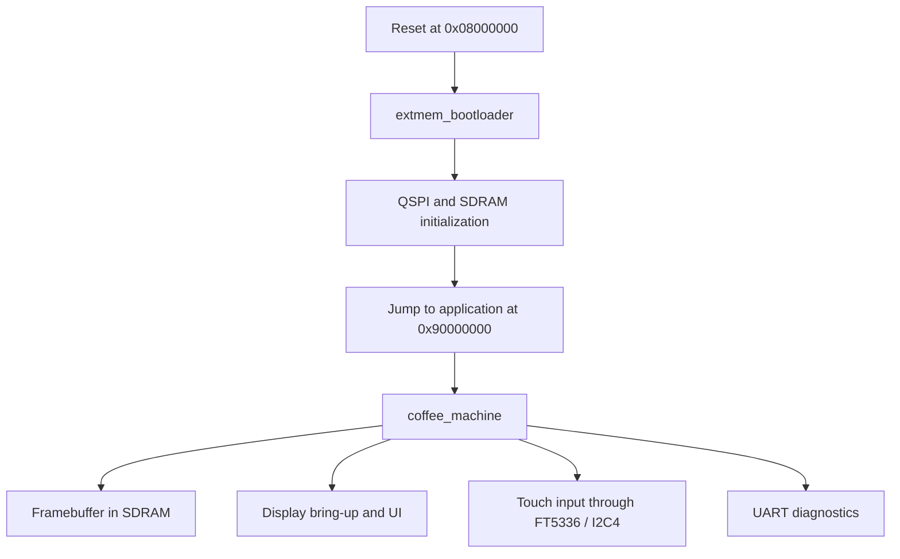

# Coffee Machine

## User View

TBD.

## 3) 3) Architecture overview for the developer

This project is built around a two-stage runtime:

- an internal bootloader initializes external memory
- the main application then executes from external QSPI flash

That architecture affects:

- how the board boots
- how software is programmed
- how debugging works
- why display and memory bring-up are staged

Start here:

- [Architecture](./docs/01-architecture/README.md)
- [Build and Flash](./docs/02-build-and-flash/README.md)
- [Debugging](./docs/03-debugging/README.md)
- [Drivers](./docs/04-drivers/README.md)
- [Artifacts](./docs/05-artifacts/README.md)
- [TouchGFX](./docs/06-touchgfx/README.md)

The developer documentation is organized around practical workflows:

- architecture and ownership of the runtime pieces
- build and flash entry points
- debug workflows in Visual Studio / VisualGDB
- driver chapters for QSPI, SDRAM, display, touch, and UART
- generated and developer-facing artifacts

## Quick Start

## For Bootloader Work

Use this path when you are changing or debugging:

- QSPI bring-up
- SDRAM bring-up
- jump-to-application behavior
- bootloader startup faults

Steps:

1. In Visual Studio, select the `Debug` build configuration.
2. Build the project.
3. Program the bootloader with `flash_bootloader` if needed.
4. Start debugging `extmem_bootloader`.
5. Set breakpoints in bootloader source files through the IDE.

Detailed guide:

- [Build and Flash](./docs/02-build-and-flash/README.md)
- [Debugging](./docs/03-debugging/README.md)

## For Application Work

Use this path when you are changing or debugging:

- application startup
- LTDC / display bring-up
- UART diagnostics
- TouchGFX integration

Steps:

1. In Visual Studio, select the `Debug` build configuration.
2. Build the project.
3. Program the application with `flash_app`.
4. Start debugging `coffee_machine`.
5. Follow the validated Boot-to-App debug sequence in the debugging chapter.

Detailed guide:

- [Build and Flash](./docs/02-build-and-flash/README.md)
- [Debugging](./docs/03-debugging/README.md)

## For Full-System Programming

Use this path when you want the complete software state on the board.

Steps:

1. Select `Debug` or `Release`.
2. Build the project.
3. Run `flash_system`.
4. Run the board standalone or start the matching debug path.

Typical use cases:

- synchronize bootloader and application together
- prepare a known-good board state
- create a release-style runtime image

## Runtime Overview

## Developer Reading Order

If you are new to the project, the recommended reading order is:

1. [Architecture](./docs/01-architecture/README.md)
2. [Build and Flash](./docs/02-build-and-flash/README.md)
3. [Debugging](./docs/03-debugging/README.md)
4. [Drivers](./docs/04-drivers/README.md)
5. [Artifacts](./docs/05-artifacts/README.md)

## Project Outputs

Main projects:

- `coffee_machine`
- `extmem_bootloader`

Main flash targets:

- `flash_app`
- `flash_bootloader`
- `flash_system`

Internal helper artifacts are documented here:

- [Artifacts](./docs/05-artifacts/README.md)

## Licence

This project is licensed under the terms of the 
