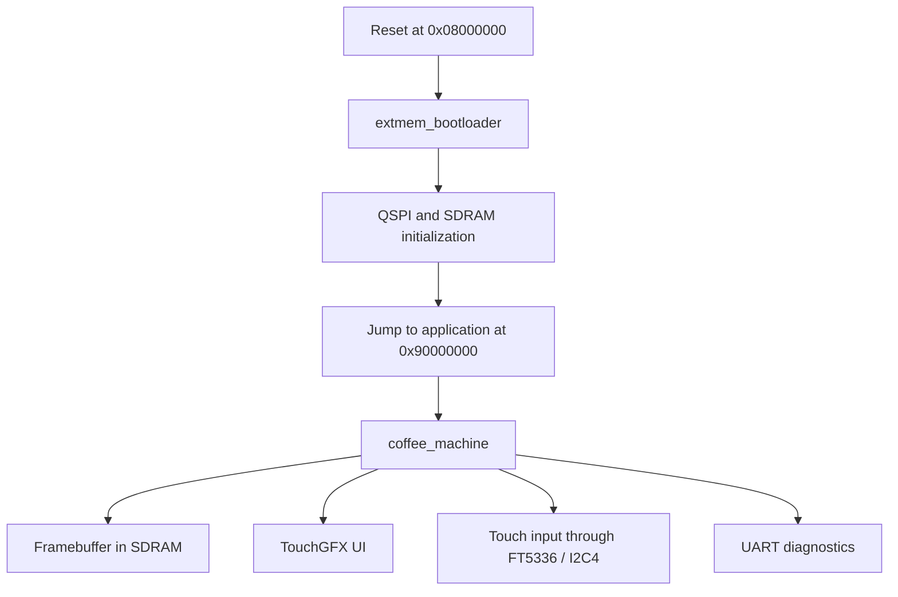

# Coffee Machine

Coffee machine demonstrator for the **STM32H750B-DK** with:

- internal bootloader in internal flash
- XIP application in external QSPI flash
- framebuffer in external SDRAM
- TouchGFX user interface with touch input
- UART-based developer diagnostics

## 1) What does the application do?

The project is a demonstrator for a small embedded coffee machine UI on the **STM32H750B-DK**.

### Splash screen

### Selection screen

## Brewing screen

At runtime it:

- boots through an internal bootloader
- initializes external QSPI flash and SDRAM
- jumps into the main application running from external flash
- brings up LTDC, framebuffer, touch, and UART diagnostics
- shows a TouchGFX-based coffee-machine flow

The current demonstrator flow is:

1. splash screen
2. automatic transition after `5 s`
3. selection screen
4. touch-based drink selection
5. brewing screen with progress, countdown, pouring animation, and steam animation
6. automatic return to the selection screen

Current drink variants:

- Espresso
- Cappuccino
- Latte
- Americano

## 2) Developer Workflows

The project is organized around a few practical developer use cases:

- debug the bootloader
- debug the application
- flash only the bootloader
- flash only the application
- flash the full validated software stack
- continue TouchGFX work without breaking the board bring-up

The main developer-facing entry points are:

- projects
  - `extmem_bootloader`
  - `coffee_machine`
- flash targets
  - `flash_bootloader`
  - `flash_app`
  - `flash_system`

### Bootloader work

Use this path when you are changing or debugging:

- QSPI bring-up
- SDRAM bring-up
- jump-to-application behavior
- early startup faults before the app owns execution

Typical flow:

1. Select the `Debug` configuration in Visual Studio / VisualGDB.
2. Build the project.
3. Run `flash_bootloader` if the bootloader image changed.
4. Start debugging `extmem_bootloader`.
5. Set breakpoints in bootloader source files through the IDE.

Detailed guides:

- [docs/02-build-and-flash/README.md](./docs/02-build-and-flash/README.md)
- [docs/03-debugging/README.md](./docs/03-debugging/README.md)

### Application work

Use this path when you are changing or debugging:

- application startup after the bootloader hand-off
- LTDC / display logic
- touch integration
- UART diagnostics
- TouchGFX screens and model logic

Typical flow:

1. Select the `Debug` configuration.
2. Build the project.
3. Run `flash_app` if the application image changed.
4. Start debugging `coffee_machine`.
5. Follow the validated application or boot-to-app debug path from the debugging chapter.

Detailed guides:

- [docs/02-build-and-flash/README.md](./docs/02-build-and-flash/README.md)
- [docs/03-debugging/README.md](./docs/03-debugging/README.md)
- [docs/06-touchgfx/README.md](./docs/06-touchgfx/README.md)

### Full-system programming

Use this path when you want the complete validated software state on the board.

Typical flow:

1. Select `Debug` or `Release`.
2. Build the project.
3. Run `flash_system`.
4. Run the board standalone or continue with the matching debug workflow.

Typical use cases:

- synchronize bootloader and application together
- prepare a known-good board state
- create a release-style runtime image

Detailed guide:

- [docs/02-build-and-flash/README.md](./docs/02-build-and-flash/README.md)

## 3) Architecture Overview

This project is built around a two-stage runtime:

- an internal bootloader initializes external memory and performs the hand-off
- the main application executes in place from external QSPI flash

That architecture affects:

- boot behavior
- flash workflows
- debugger setup
- memory layout
- display and touch bring-up

Runtime overview:

Read the full architecture chapter here:

- [docs/01-architecture/README.md](./docs/01-architecture/README.md)

## 4) Documentation Map

The developer documentation is split by responsibility and workflow:

- [docs/01-architecture/README.md](./docs/01-architecture/README.md)
  - runtime structure, memory layout, boot path, hand-off design
- [docs/02-build-and-flash/README.md](./docs/02-build-and-flash/README.md)
  - build targets, flash targets, Debug vs. Release usage
- [docs/03-debugging/README.md](./docs/03-debugging/README.md)
  - Visual Studio / VisualGDB workflows, application debug, boot-to-app debug
- [docs/04-drivers/README.md](./docs/04-drivers/README.md)
  - driver overview and links to detailed hardware chapters
- [docs/05-artifacts/README.md](./docs/05-artifacts/README.md)
  - developer-facing outputs and internal helper artifacts
- [docs/06-touchgfx/README.md](./docs/06-touchgfx/README.md)
  - TouchGFX flow, model/presenter ownership, simulation contract, UI assets

### Driver chapters

- [docs/04-drivers/fmc-sdram.md](./docs/04-drivers/fmc-sdram.md)
- [docs/04-drivers/qspi-xip.md](./docs/04-drivers/qspi-xip.md)
- [docs/04-drivers/ltdc-display.md](./docs/04-drivers/ltdc-display.md)
- [docs/04-drivers/touch-input.md](./docs/04-drivers/touch-input.md)
- [docs/04-drivers/uart-debug.md](./docs/04-drivers/uart-debug.md)

## 5) File Responsibilities

| File | Responsibility |
|---|---|
| `CMakeLists.txt` | Top-level build structure, projects, flash targets, helper artifacts. |
| `ExtMem_Boot/Src/main.c` | Bootloader startup and application hand-off. |
| `Core/Src/main.cpp` | Application entry point and top-level startup orchestration. |
| `coffee_machine/coffee_machine_app.hpp/.cpp` | Handwritten application facade around TouchGFX startup and processing. |
| `coffee_machine/coffee_machine_board.hpp/.cpp` | Board bootstrap, LTDC test path, SDRAM validation, UART logging, fatal handling. |
| `coffee_machine/coffee_machine_simulation.hpp/.cpp` | Handwritten brewing-domain simulation used by TouchGFX. |
| `coffee_machine/countdown_formatter.hpp/.cpp` | Formatting helper for brewing countdown text. |
| `TouchGFX/gui/src/...` | Handwritten TouchGFX views, presenters, model logic. |
| `TouchGFX/generated/...` | Generated TouchGFX code; regenerate with care. |
| `Drivers/BSP/STM32H750B-DK/...` | Board-level QSPI, SDRAM, LTDC, and touch support. |
| `tools/visualgdb/...` | VisualGDB profile support files for validated debug workflows. |

## 6) Recommended Reading Order

If you are new to the project, this reading order works well:

1. [docs/01-architecture/README.md](./docs/01-architecture/README.md)
2. [docs/02-build-and-flash/README.md](./docs/02-build-and-flash/README.md)
3. [docs/03-debugging/README.md](./docs/03-debugging/README.md)
4. [docs/04-drivers/README.md](./docs/04-drivers/README.md)
5. [docs/05-artifacts/README.md](./docs/05-artifacts/README.md)
6. [docs/06-touchgfx/README.md](./docs/06-touchgfx/README.md)

## License

This project is licensed under the terms of the 
