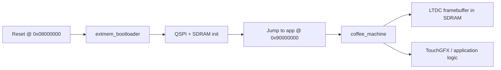

# Coffee Machine

## User View

TBD.

## Developer View

See:

- [Architecture](/C:/st_apps/coffee_machine/docs/01-architecture/README.md)
- [Build and Flash](/C:/st_apps/coffee_machine/docs/02-build-and-flash/README.md)
- [Debugging](/C:/st_apps/coffee_machine/docs/03-debugging/README.md)
- [Drivers](/C:/st_apps/coffee_machine/docs/04-drivers/README.md)
- [Artifacts](/C:/st_apps/coffee_machine/docs/05-artifacts/README.md)
- [TouchGFX](/C:/st_apps/coffee_machine/docs/06-touchgfx/README.md)

## Quick Start

TBD.

## Architecture Overview

