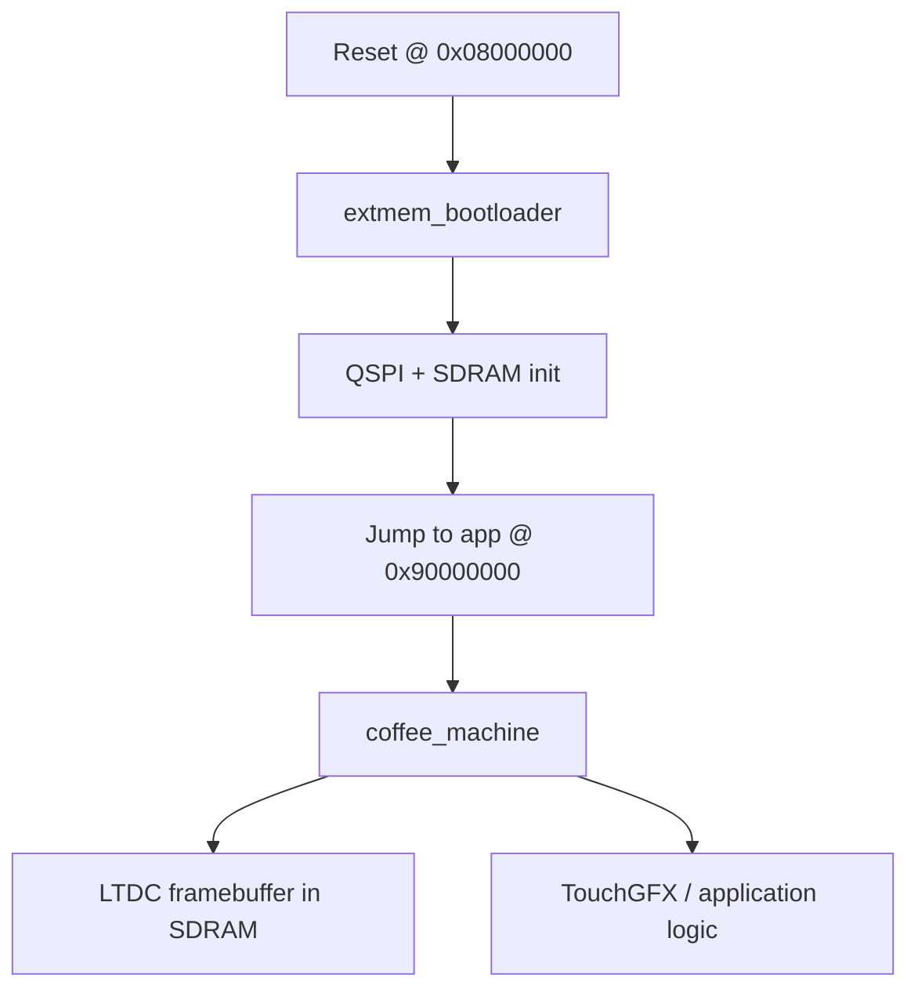

# Coffee Machine

## User View

TBD.

## Developer View

See:

- [Architecture](./docs/01-architecture/README.md)
- [Build and Flash](./docs/02-build-and-flash/README.md)
- [Debugging](./docs/03-debugging/README.md)
- [Drivers](./docs/04-drivers/README.md)
- [Artifacts](./docs/05-artifacts/README.md)
- [TouchGFX](./docs/06-touchgfx/README.md)

## Quick Start

TBD.

## Architecture Overview
### Flow from boot to an app

