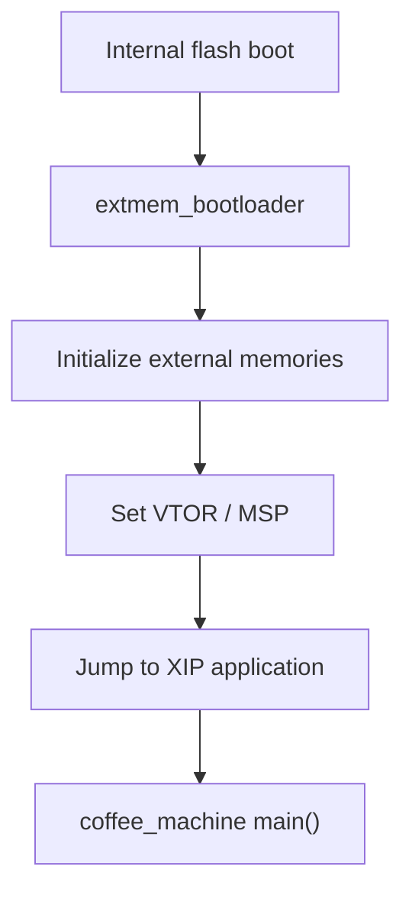

# Architecture

## Goal

Describe the runtime architecture and explain why it was chosen.

## Runtime Layout

TBD.

## Boot Paths

TBD.

## Memory Layout

TBD.

## Why This Architecture

TBD.

## Diagram

