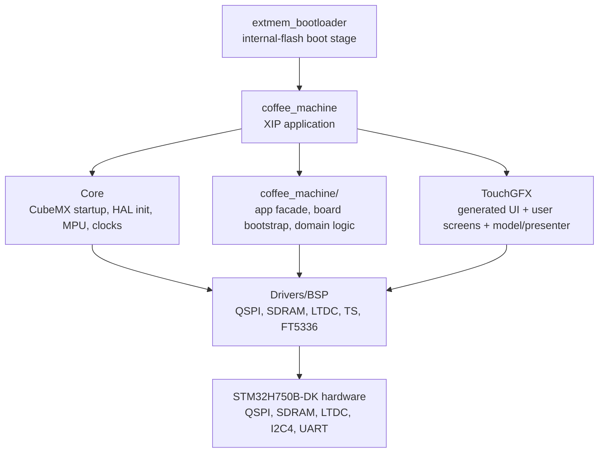
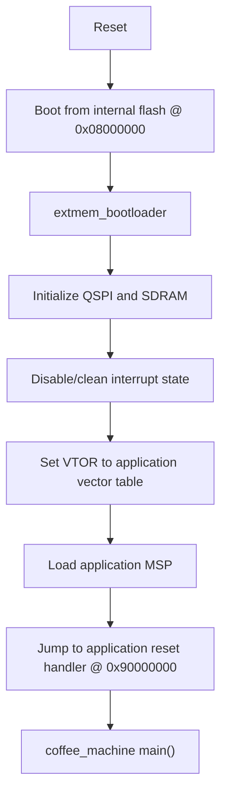
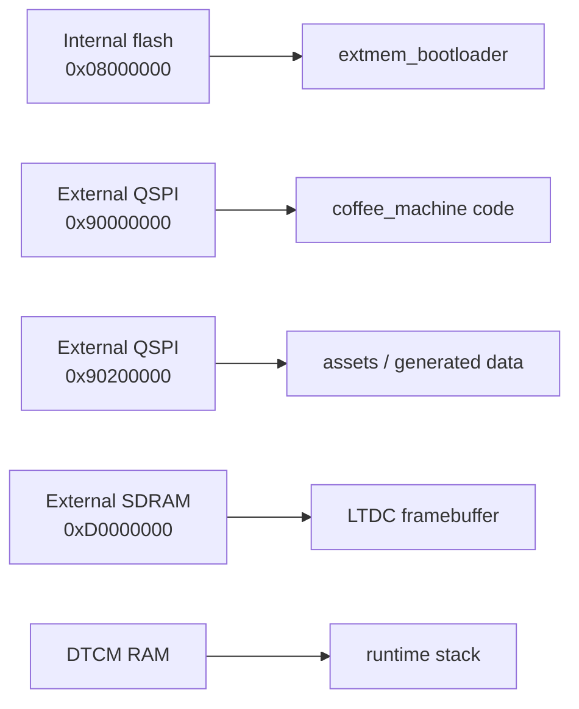
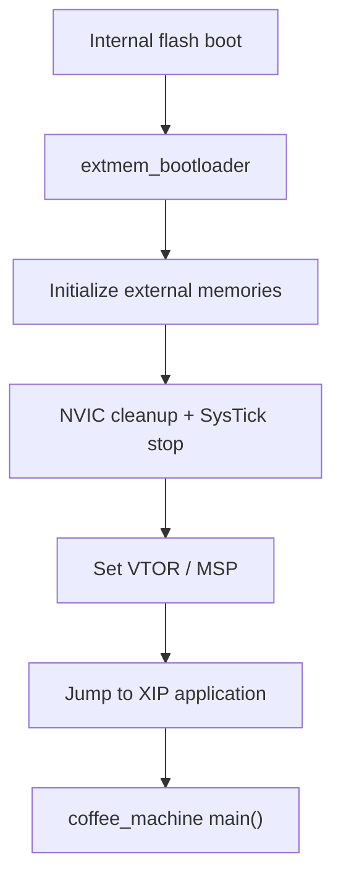

# Architecture

## Goal

Describe the runtime architecture and explain why it was chosen.

## Runtime Layout

This project uses a two-stage runtime layout:

1. An internal bootloader starts from internal flash at `0x08000000`
2. The main application executes in place (XIP) from external QSPI flash at `0x90000000`

The framebuffer is placed in external SDRAM.

This split was chosen because the STM32H750 device has limited internal flash, while the application, generated UI assets, and TouchGFX-related code are much larger than what should comfortably live in internal flash.

## Developer Structure

The runtime architecture explains where code executes.

The structure below explains where responsibilities live in the repository.



Practical ownership model:

- `ExtMem_Boot` owns reset-to-app hand-off
- `Core` owns generated MCU setup and HAL-level peripheral initialization
- `coffee_machine` owns handwritten app/bootstrap/domain code
- `TouchGFX` owns the UI structure
- `Drivers/BSP` owns the board- and component-level hardware adapters

## Boot Paths

### Normal runtime path



### Why the direct application start is not the default path

Starting directly at `0x90000000` was evaluated, but it was not robust enough in the current setup.

The main reason is architectural:

- the external QSPI XIP path must already be valid at the moment the CPU fetches the first application instructions
- in practice, the project was stabilized by letting the internal bootloader initialize external memory first

That is why the default and recommended runtime path remains:

- option byte boot address -> internal flash
- bootloader first
- application second

## Memory Layout

The relevant memory regions are:

- internal bootloader flash at `0x08000000`
- external QSPI application flash at `0x90000000`
- external QSPI assets flash at `0x90200000`
- SDRAM framebuffer at `0xD0000000`
- stack in DTCM RAM

This is reflected in:

- [STM32H750XBHX_FLASH.ld](C:/st_apps/coffee_machine/STM32H750XBHX_FLASH.ld)

At a high level:



### Practical meaning

- internal flash contains only the minimal runtime entry path
- external QSPI contains the main application
- SDRAM contains large display data
- the application itself does not have to fit into internal flash

## Why This Architecture

This architecture was chosen because it solved the actual problems encountered during bring-up.

### 1. Internal flash alone is not the right home for the full application

The application, generated GUI code, TouchGFX runtime, and supporting assets are a better fit for an external-memory design.

### 2. External XIP must be initialized before the application can run safely

The stable solution was:

- start from internal flash
- initialize QSPI memory-mapped mode and SDRAM in the bootloader
- only then jump into the XIP application

### 3. The bootloader must hand over control cleanly

The final hand-off had to do more than just branch to the application.

The critical pieces were:

- disable and clean pending interrupts
- stop SysTick
- set `SCB->VTOR` to the application vector table
- set `MSP` from the application vector table
- jump to the application reset handler

This logic lives in:

- [ExtMem_Boot/Src/main.c](C:/st_apps/coffee_machine/ExtMem_Boot/Src/main.c)

### 4. The application must not re-break the early memory setup

During stabilization, several early application-side behaviors had to be adjusted:

- no premature QSPI reconfiguration during XIP bring-up
- no fragile early FMC speculative-access handling in `SystemInit()`
- correct SDRAM initialization sequence in the application-side FMC path
- a tick-independent fallback for the SDRAM component delay path

Those fixes were necessary to move from:

- "boots sometimes / faults early"

to:

- "bootloader starts"
- "jump works"
- "application runs"
- "test pattern and UART diagnostics work"

## Bootloader Hand-off Details

The internal bootloader is not just a packaging helper. It is the runtime bridge between reset and application startup.

### Responsibilities of `extmem_bootloader`

- configure clocks required for boot-time peripheral initialization
- initialize external memory infrastructure
- prepare QSPI XIP access
- prepare SDRAM access
- clean interrupt state before hand-off
- transfer control to the external application

### Critical hand-off operations

The important operations in the hand-off path are:

- `SCB->VTOR = APPLICATION_ADDRESS`
- `__set_MSP(*(uint32_t*)APPLICATION_ADDRESS)`
- read reset handler from `APPLICATION_ADDRESS + 4`
- jump via function pointer

Additionally, the bootloader now performs NVIC cleanup before the jump:

- disable interrupts
- clear pending interrupt state
- stop SysTick

Without this cleanup, stale interrupt state can leak across the hand-off and cause confusing early faults.

## Key Project Files

These files are central to understanding the final architecture:

- [CMakeLists.txt](C:/st_apps/coffee_machine/CMakeLists.txt)
  - defines projects, flash targets, and generated artifacts
- [STM32H750XBHX_FLASH.ld](C:/st_apps/coffee_machine/STM32H750XBHX_FLASH.ld)
  - defines the memory layout of the XIP application
- [ExtMem_Boot/Src/main.c](C:/st_apps/coffee_machine/ExtMem_Boot/Src/main.c)
  - bootloader startup and jump-to-application logic
- [Core/Src/main.cpp](C:/st_apps/coffee_machine/Core/Src/main.cpp)
  - application entry path and startup orchestration
- [coffee_machine/coffee_machine_board.cpp](C:/st_apps/coffee_machine/coffee_machine/coffee_machine_board.cpp)
  - board bootstrap, LTDC test pattern, SDRAM validation, UART logging, fatal handling
- [coffee_machine/coffee_machine_app.cpp](C:/st_apps/coffee_machine/coffee_machine/coffee_machine_app.cpp)
  - application-side TouchGFX startup and processing facade
- [coffee_machine/coffee_machine_simulation.cpp](C:/st_apps/coffee_machine/coffee_machine/coffee_machine_simulation.cpp)
  - brewing-domain state machine behind the demonstrator flow
- [Core/Src/fmc.c](C:/st_apps/coffee_machine/Core/Src/fmc.c)
  - application-side SDRAM initialization
- [Drivers/BSP/STM32H750B-DK/stm32h750b_discovery_qspi.c](C:/st_apps/coffee_machine/Drivers/BSP/STM32H750B-DK/stm32h750b_discovery_qspi.c)
  - board-level QSPI support
- [Drivers/BSP/STM32H750B-DK/stm32h750b_discovery_sdram.c](C:/st_apps/coffee_machine/Drivers/BSP/STM32H750B-DK/stm32h750b_discovery_sdram.c)
  - board-level SDRAM support
- [Drivers/BSP/STM32H750B-DK/stm32h750b_discovery_ts.c](C:/st_apps/coffee_machine/Drivers/BSP/STM32H750B-DK/stm32h750b_discovery_ts.c)
  - board-level FT5336 touch support
- [TouchGFX/target/STM32TouchController.cpp](C:/st_apps/coffee_machine/TouchGFX/target/STM32TouchController.cpp)
  - TouchGFX adapter that samples touch coordinates from the BSP
- [tools/visualgdb/README.md](C:/st_apps/coffee_machine/tools/visualgdb/README.md)
  - switchable VisualGDB profile templates used for project debug workflows

## Important Project and Board Settings

These settings turned out to be essential.

### Option bytes

The normal and recommended board boot address is:

- `BOOT_CM7_ADD0 = 0x08000000`

That keeps the internal bootloader in control of startup.

### Debug strategy

The stable debug strategy is split by developer use case:

- bootloader debug via `extmem_bootloader`
- application debug via `coffee_machine`
- board still starts through the bootloader in the validated boot-to-app path

The most important project files behind this are:

- [coffee_machine.vgdbcmake](C:/st_apps/coffee_machine/coffee_machine.vgdbcmake)
- [coffee_machine.boot_to_app_debug.vgdbcmake](C:/st_apps/coffee_machine/tools/visualgdb/coffee_machine.boot_to_app_debug.vgdbcmake)

These files matter because the runtime architecture alone was not enough. The IDE/debugger startup behavior also had to be aligned with the bootloader-to-application hand-off.

### VisualGDB settings that mattered

The working boot-to-app debug path depended on a few non-obvious VisualGDB settings.

#### 1. The main debug target had to be `coffee_machine`

For the application-oriented debug path, the VisualGDB profile had to use:

- `MainCMakeTarget = coffee_machine`
- `StartupTarget = coffee_machine`

This allows the application to be the main debug module while the board still boots through the internal bootloader at runtime.

#### 2. Bootloader symbols had to be added explicitly

The boot-to-app debug profile adds the bootloader symbol file during debugger startup:

```gdb
add-symbol-file C:/st_apps/coffee_machine/build/VisualGDB/Debug/extmem_bootloader 0x08000000
```

This makes the debugger aware of the internal bootloader address space while `coffee_machine` remains the main debug target.

#### 3. Early automatic "step into main" behavior had to be disabled

The following VisualGDB setting had to be left empty:

- `StepIntoNewInstanceEntry`

In practice, leaving an automatic startup-entry breakpoint enabled caused unstable startup behavior in this multi-stage boot path.

### Debugger breakpoint behavior

For the current VisualGDB-based boot-to-app debug path, hardware breakpoints had to be enforced to avoid early startup failures caused by software breakpoint / flash hotpatch behavior during the bootloader-to-application transition.

The important settings were:

- `mon gdb_breakpoint_override hard`
- `FLASHPatcher xsi:nil="true"`

The first forces GDB/OpenOCD breakpoints into hardware-breakpoint mode.

The second disables VisualGDB flash hotpatching for this path.

Where to find them:

  - `mon gdb_breakpoint_override hard`
  - [coffee_machine.vgdbcmake](C:/st_apps/coffee_machine/coffee_machine.vgdbcmake)
  - [coffee_machine.boot_to_app_debug.vgdbcmake](C:/st_apps/coffee_machine/tools/visualgdb/coffee_machine.boot_to_app_debug.vgdbcmake)
  - inside the OpenOCD startup command list

- `FLASHPatcher xsi:nil="true"`
  - [coffee_machine.vgdbcmake](C:/st_apps/coffee_machine/coffee_machine.vgdbcmake)
  - [coffee_machine.boot_to_app_debug.vgdbcmake](C:/st_apps/coffee_machine/tools/visualgdb/coffee_machine.boot_to_app_debug.vgdbcmake)
  - as the XML `<FLASHPatcher xsi:nil="true" />` node

This combination turned out to be essential for reliable early application breakpoints after startup.

## ST References

The following ST documents were important references while shaping this architecture:

- [AN5188 - How to execute code from external memory on STM32F7 and STM32H750/H7B0/H730 MCUs](https://www.st.com/resource/en/application_note/an5188-how-to-execute-code-from-external-memory-on-stm32f7-and-stm32h750h7b0h730-mcus-stmicroelectronics.pdf)
- [AN5188 - External memory code execution on STM32F7x0 value line, STM32H750 value line, STM32H7B0 value line and STM32H730 value line MCUs](https://www.st.com/resource/en/application_note/an5188-external-memory-code-execution-on-stm32f7x0-value-line-stm32h750-value-line-stm32h7b0-value-line-and-stm32h730-value-line-mcus-stmicroelectronics.pdf)
- [UM2488 - Discovery kit with STM32H750XB microcontroller](https://www.st.com/resource/en/user_manual/um2488-discovery-kits-with-stm32h745xi-and-stm32h750xb-microcontrollers-stmicroelectronics.pdf)
- [STM32H750 Value Line product page](https://www.st.com/en/microcontrollers-microprocessors/stm32h750-value-line.html)

## Diagram


