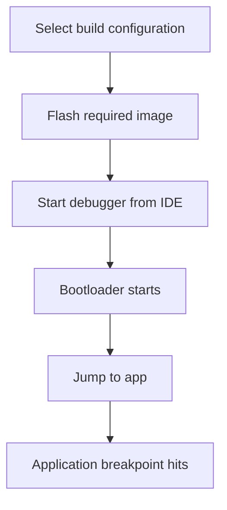

# Debugging

## Goal

Explain which debug path to use for each developer use case.

## Debug Scenarios

### Bootloader Debug

TBD.

### Boot-to-App Debug

TBD.

### Direct App Debug

Current status: experimental / not the default path.

## IDE Workflow

For each scenario, document:

1. Which profile or target is active
2. Which breakpoint to set in the IDE
3. Which button to press in Visual Studio / VisualGDB
4. What to expect on the board and UART

## GDB Workflow

Only document commands that are still required in practice.

Use flat step-by-step instructions.

## Typical Pitfalls

TBD.

## Debug Flow Diagram

