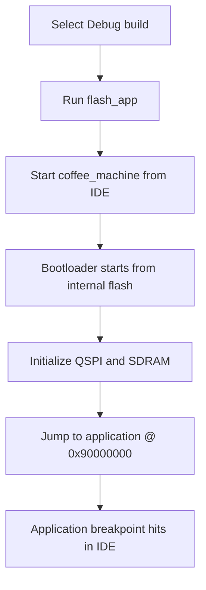

# Debugging

## Goal

Explain which debug path to use for each developer use case.

## Debug Scenarios

### Bootloader Debug

Use this path when the problem is inside the bootloader itself.

Primary target:

- [extmem_bootloader](C:/st_apps/coffee_machine/build/VisualGDB/Debug/extmem_bootloader)

Use this path for:

- external memory initialization
- bootloader clock setup
- QSPI memory-mapped mode
- SDRAM initialization
- jump-to-application preparation

Expected IDE behavior:

- normal IDE breakpoints in bootloader source files
- normal start from the IDE
- no manual GDB commands required for everyday work

### Boot-to-App Debug

Use this path when the runtime starts through the bootloader, but the main debugging target is the application.

Primary target:

- [coffee_machine](C:/st_apps/coffee_machine/build/VisualGDB/Debug/coffee_machine)

Runtime behavior:

- board starts at internal flash
- bootloader runs first
- bootloader initializes external memory
- bootloader jumps to the application
- IDE breakpoints in the application can then be reached

Use this path for:

- application debugging with realistic boot conditions
- LTDC / framebuffer bring-up
- UART application diagnostics
- TouchGFX integration

Current status:

- validated and usable
- requires a short GDB symbol-loading sequence before application breakpoints are reliable
- preferred workflow when the developer wants to inspect the real bootloader-to-application hand-off
- depends on specific VisualGDB profile settings that were added to stabilize this path

## IDE Workflow

### Bootloader Debug

1. Select the `Debug` build configuration.
2. Program the bootloader with `flash_bootloader` if needed.
3. In the Project Explorer, select [extmem_bootloader](C:/st_apps/coffee_machine/build/VisualGDB/Debug/extmem_bootloader).
4. Set breakpoints in bootloader source files through the IDE.
5. Press `Start`.

Expected behavior:

- the debugger starts in the bootloader
- bootloader breakpoints are reached directly

### Boot-to-App Debug

1. Select the `Debug` build configuration.
2. Program the application with `flash_app`.
3. In the Project Explorer, select [coffee_machine](C:/st_apps/coffee_machine/build/VisualGDB/Debug/coffee_machine).
4. Press `Start`.
5. Delete existing breakpoints through the IDE breakpoint window.
6. In the GDB Session window, enter:

```gdb
symbol-file C:/st_apps/coffee_machine/build/VisualGDB/Debug/extmem_bootloader
add-symbol-file C:/st_apps/coffee_machine/build/VisualGDB/Debug/coffee_machine 0x90000000
delete breakpoints
```

7. Set breakpoints in [main.cpp](C:/st_apps/coffee_machine/Core/Src/main.cpp).
8. Press `Continue`.

Expected behavior:

- the debugger starts in the bootloader
- bootloader symbols are active first
- application symbols are then added for the XIP address space
- application breakpoints can be reached after the jump to the XIP application

## Project File Settings Behind This Workflow

The validated Boot-to-App debug path is not just a sequence of manual commands. It also depends on project-level VisualGDB settings.

Primary files:

- [coffee_machine.vgdbcmake](C:/st_apps/coffee_machine/coffee_machine.vgdbcmake)
- [coffee_machine.boot_to_app_debug.vgdbcmake](C:/st_apps/coffee_machine/tools/visualgdb/coffee_machine.boot_to_app_debug.vgdbcmake)

Important settings in the Boot-to-App profile:

- `MainCMakeTarget = coffee_machine`
- `StartupTarget = coffee_machine`
- startup command:
  - `add-symbol-file C:/st_apps/coffee_machine/build/VisualGDB/Debug/extmem_bootloader 0x08000000`
- empty `StepIntoNewInstanceEntry`
- startup command:
  - `mon gdb_breakpoint_override hard`
- flash patcher disabled:
  - `FLASHPatcher xsi:nil="true"`

Where to find these:

- [coffee_machine.vgdbcmake](C:/st_apps/coffee_machine/coffee_machine.vgdbcmake)
- [coffee_machine.boot_to_app_debug.vgdbcmake](C:/st_apps/coffee_machine/tools/visualgdb/coffee_machine.boot_to_app_debug.vgdbcmake)

IDE locations and XML hints:

- `add-symbol-file C:/st_apps/coffee_machine/build/VisualGDB/Debug/extmem_bootloader 0x08000000`
  - VisualGDB: `Debug Settings -> Additional GDB Commands -> after selecting a target`
  - XML location: `<AdditionalStartupCommands><GDBStartupCommands>...`

- `mon gdb_breakpoint_override hard`
  - VisualGDB: `Debug Settings -> Startup GDB commands`
  - XML location: `<DebugMethod><Configuration><StartupCommands>...`

- `FLASHPatcher xsi:nil="true"`
  - XML-only setting in the current project files
  - XML location: `<FLASHPatcher xsi:nil="true" />`
  - files:
    - [coffee_machine.vgdbcmake](C:/st_apps/coffee_machine/coffee_machine.vgdbcmake)
    - [coffee_machine.boot_to_app_debug.vgdbcmake](C:/st_apps/coffee_machine/tools/visualgdb/coffee_machine.boot_to_app_debug.vgdbcmake)

Why these mattered:

- `coffee_machine` had to be the main debug target for normal app-side IDE work
- the bootloader symbol file still had to be known to the debugger
- automatic early entry break behavior caused startup issues
- software-breakpoint / flash-hotpatch behavior was not reliable enough for this boot path
- hardware breakpoints made the startup path stable enough for practical IDE debugging

Typical validated breakpoint locations:

- [main.cpp](C:/st_apps/coffee_machine/Core/Src/main.cpp) in `main()`
- [main.cpp](C:/st_apps/coffee_machine/Core/Src/main.cpp) in `DebugProbe_AppEntry()`

### Release Image Debugging

1. Select `Release`.
2. Program the board with `flash_system`.
3. Start the matching debug target only if needed.

Expected behavior:

- runtime should work
- source-level debugging is limited by optimization
- line breakpoints may behave less predictably than in `Debug`

## GDB Workflow

### Bootloader Debug

No manual GDB commands are expected in the normal workflow.

### Boot-to-App Debug

The currently validated workflow does require a short manual GDB sequence:

```gdb
symbol-file C:/st_apps/coffee_machine/build/VisualGDB/Debug/extmem_bootloader
add-symbol-file C:/st_apps/coffee_machine/build/VisualGDB/Debug/coffee_machine 0x90000000
delete breakpoints
```

After that:

- set application breakpoints in the IDE
- press `Continue`

### Investigative Work

Additional manual GDB commands may still be used when diagnosing early startup, symbol loading, or debug-profile problems.

## Typical Pitfalls

### Breakpoints in optimized builds

In `Release`, breakpoints can move, collapse, or appear inconsistent because of optimization.

### Flash target vs. debug target

Do not confuse:

- flash targets, which program the board
- debug targets, which define what the IDE starts and debugs

Example:

- `flash_app` programs the external application image
- [coffee_machine](C:/st_apps/coffee_machine/build/VisualGDB/Debug/coffee_machine) is the application debug target

### Boot-to-App breakpoints must be reset after symbol loading

For the currently validated workflow:

- delete IDE breakpoints first
- load bootloader and application symbols in the GDB Session window
- delete breakpoints again in GDB
- then set application breakpoints in the IDE
- then continue execution

### If UART output is missing during debugging

First verify:

- the board actually ran past bootloader startup
- the application reached the expected debug point
- the host terminal was connected and ready after reset

## Debug Flow Diagram


