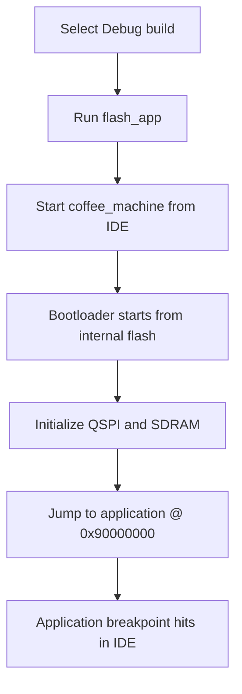

# Debugging

## Goal

Explain which debug path to use for each developer use case.

## Debug Scenarios

### Bootloader Debug

Use this path when the problem is inside the bootloader itself.

Primary target:

- [extmem_bootloader](C:/st_apps/coffee_machine/build/VisualGDB/Debug/extmem_bootloader)

Use this path for:

- external memory initialization
- bootloader clock setup
- QSPI memory-mapped mode
- SDRAM initialization
- jump-to-application preparation

Expected IDE behavior:

- normal IDE breakpoints in bootloader source files
- normal start from the IDE
- no manual GDB commands required for everyday work

### Boot-to-App Debug

Use this path when the runtime starts through the bootloader, but the main debugging target is the application.

Primary target:

- [coffee_machine](C:/st_apps/coffee_machine/build/VisualGDB/Debug/coffee_machine)

Runtime behavior:

- board starts at internal flash
- bootloader runs first
- bootloader initializes external memory
- bootloader jumps to the application
- IDE breakpoints in the application can then be reached

Use this path for:

- application debugging with realistic boot conditions
- LTDC / framebuffer bring-up
- UART application diagnostics
- TouchGFX integration

Current status:

- validated and usable
- preferred application debug workflow

### Direct App Debug

Current status: experimental / not the default path.

Reason:

- direct start of the XIP application without the normal bootloader path was not robust enough in the current setup
- this path should not be the default developer workflow

## IDE Workflow

### Bootloader Debug

1. Select the `Debug` build configuration.
2. Program the bootloader with `flash_bootloader` if needed.
3. In the Project Explorer, select [extmem_bootloader](C:/st_apps/coffee_machine/build/VisualGDB/Debug/extmem_bootloader).
4. Set breakpoints in bootloader source files through the IDE.
5. Press `Start`.

Expected behavior:

- the debugger starts in the bootloader
- bootloader breakpoints are reached directly

### Boot-to-App Debug

1. Select the `Debug` build configuration.
2. Program the application with `flash_app`.
3. In the Project Explorer, select [coffee_machine](C:/st_apps/coffee_machine/build/VisualGDB/Debug/coffee_machine).
4. Set breakpoints in application source files through the IDE.
5. Press `Start`.

Expected behavior:

- the board starts through the bootloader
- the bootloader runs without requiring manual GDB intervention
- the debugger reaches application breakpoints after the jump to the XIP application

Typical validated breakpoint locations:

- [main.cpp](C:/st_apps/coffee_machine/Core/Src/main.cpp) in `main()`
- [main.cpp](C:/st_apps/coffee_machine/Core/Src/main.cpp) in `DebugProbe_*()` helper functions

### Release Image Debugging

1. Select `Release`.
2. Program the board with `flash_system`.
3. Start the matching debug target only if needed.

Expected behavior:

- runtime should work
- source-level debugging is limited by optimization
- line breakpoints may behave less predictably than in `Debug`

## GDB Workflow

Normal validated workflows no longer require manual GDB commands.

That is the desired state.

Use the GDB terminal only for investigation when:

- a debug profile is being repaired
- a symbol mapping problem is being analyzed
- early startup behavior must be diagnosed beyond normal IDE support

## Typical Pitfalls

### Breakpoints in optimized builds

In `Release`, breakpoints can move, collapse, or appear inconsistent because of optimization.

### Flash target vs. debug target

Do not confuse:

- flash targets, which program the board
- debug targets, which define what the IDE starts and debugs

Example:

- `flash_app` programs the external application image
- [coffee_machine](C:/st_apps/coffee_machine/build/VisualGDB/Debug/coffee_machine) is the application debug target

### Direct app boot is not the default path

The direct application debug path is experimental and should not be used as the main workflow.

### If UART output is missing during debugging

First verify:

- the board actually ran past bootloader startup
- the application reached the expected debug point
- the host terminal was connected and ready after reset

## Debug Flow Diagram

