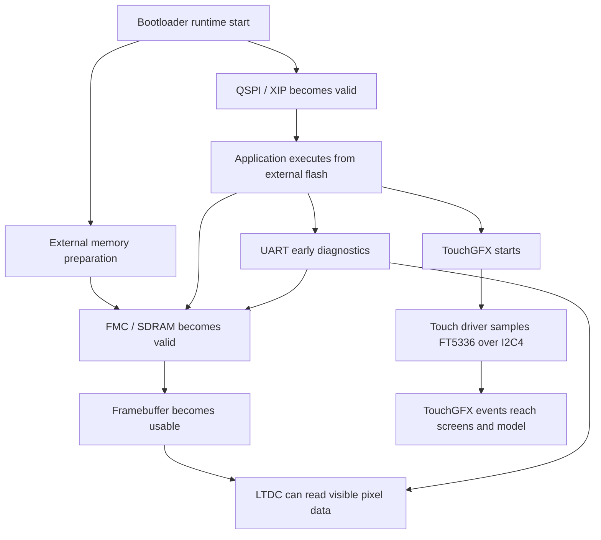

# Drivers

## Goal

Provide a subsystem-level overview of the runtime-critical drivers in this project:

- what each driver area is responsible for
- how the driver areas depend on each other
- where a developer should start when debugging a specific symptom

This chapter is the map. The individual driver chapters contain the deeper implementation details.

## Driver Areas

The project currently depends on five driver areas for basic bring-up and UI interaction:

- QSPI / External Flash / XIP
- FMC / SDRAM
- LTDC / Display
- Touch / Input
- UART / Debug Output

They do not operate independently. They form a startup chain.

## System View

The important point is:

- the app can only execute because QSPI/XIP works
- the display can only work because SDRAM works
- LTDC can only show correct output if both SDRAM and framebuffer/cache behavior are correct
- touch input can only work because the BSP FT5336 path and `I2C4` path are valid
- UART helps explain where the system stopped before the display path is trustworthy

## Subsystem Responsibilities

## QSPI / External Flash / XIP

This subsystem is responsible for:

- making the application executable from `0x90000000`
- transitioning from internal bootloader execution to external XIP execution
- preserving a stable external-execution state during startup

Read this chapter first when the symptom is:

- app does not seem to start
- bootloader jump is suspicious
- debugger behaves strangely during boot-to-app hand-off
- code fetch from external flash is suspected

Detailed chapter:

- [QSPI / External Flash / XIP](./qspi-xip.md)

## FMC / SDRAM

This subsystem is responsible for:

- making the external SDRAM valid
- preparing the framebuffer backing store at `0xD0000000`
- ensuring memory is safe before LTDC or UI code uses it

Read this chapter first when the symptom is:

- SDRAM self-test fails
- LTDC framebuffer address seems valid but display stays black
- the system hard faults when touching framebuffer memory
- startup stalls inside SDRAM init or delay logic

Detailed chapter:

- [FMC / SDRAM](./fmc-sdram.md)

## LTDC / Display

This subsystem is responsible for:

- panel timing
- layer configuration
- reading the framebuffer from SDRAM
- turning a valid framebuffer into visible output

Read this chapter first when the symptom is:

- SDRAM appears valid but the display is still black
- colors are wrong or corrupted
- the test pattern does not appear
- panel reset/backlight sequencing is in question

Detailed chapter:

- [LTDC / Display](./ltdc-display.md)

## Touch / Input

This subsystem is responsible for:

- configuring the FT5336 touch controller through the BSP
- sampling touch coordinates over `I2C4`
- mapping those coordinates into the active `480 x 272` TouchGFX screen
- delivering press events to buttons and screens

Read this chapter first when the symptom is:

- the display is visible but touch does not react
- touches are reported at the wrong coordinates
- TouchGFX screens render correctly but button callbacks do not fire
- you need to understand where the FT5336, BSP, and TouchGFX adapter meet

Detailed chapter:

- [Touch / Input](./touch-input.md)

## UART / Debug Output

This subsystem is responsible for:

- early textual diagnostics
- proving how far startup progressed
- giving developers coarse-grained execution checkpoints

Read this chapter first when the symptom is:

- startup appears silent
- you need to know whether the app reached `main()`
- you need confirmation that SDRAM or display validation passed
- the debugger alone is not enough to explain the failure

Detailed chapter:

- [UART / Debug Output](./uart-debug.md)

## Recommended Reading Order

For a developer who is new to this codebase, the most useful order is:

1. [docs/01-architecture/README.md](C:/st_apps/coffee_machine/docs/01-architecture/README.md)
2. [QSPI / External Flash / XIP](C:/st_apps/coffee_machine/docs/04-drivers/qspi-xip.md)
3. [FMC / SDRAM](C:/st_apps/coffee_machine/docs/04-drivers/fmc-sdram.md)
4. [LTDC / Display](C:/st_apps/coffee_machine/docs/04-drivers/ltdc-display.md)
5. [Touch / Input](C:/st_apps/coffee_machine/docs/04-drivers/touch-input.md)
6. [UART / Debug Output](C:/st_apps/coffee_machine/docs/04-drivers/uart-debug.md)

Why this order:

- first understand why the runtime is split across internal and external memory
- then understand how the app becomes executable
- then understand how framebuffer memory becomes valid
- then understand how the visible display path uses that memory
- then understand how user input returns from the panel into TouchGFX
- finally understand how UART helps diagnose everything else

## Symptom-To-Chapter Guide

- **The application does not seem to start**
  - start with [qspi-xip.md](C:/st_apps/coffee_machine/docs/04-drivers/qspi-xip.md)

- **The bootloader jumps, but the app crashes early**
  - start with [qspi-xip.md](C:/st_apps/coffee_machine/docs/04-drivers/qspi-xip.md)
  - then [fmc-sdram.md](C:/st_apps/coffee_machine/docs/04-drivers/fmc-sdram.md)

- **The SDRAM self-test fails**
  - start with [fmc-sdram.md](C:/st_apps/coffee_machine/docs/04-drivers/fmc-sdram.md)

- **The display is black but UART logs continue**
  - start with [ltdc-display.md](C:/st_apps/coffee_machine/docs/04-drivers/ltdc-display.md)
  - then [fmc-sdram.md](C:/st_apps/coffee_machine/docs/04-drivers/fmc-sdram.md)

- **The display works but buttons do not react**
  - start with [touch-input.md](C:/st_apps/coffee_machine/docs/04-drivers/touch-input.md)
  - then [ltdc-display.md](C:/st_apps/coffee_machine/docs/04-drivers/ltdc-display.md)

- **There are no useful logs**
  - start with [uart-debug.md](C:/st_apps/coffee_machine/docs/04-drivers/uart-debug.md)
  - then [docs/03-debugging/README.md](C:/st_apps/coffee_machine/docs/03-debugging/README.md)
