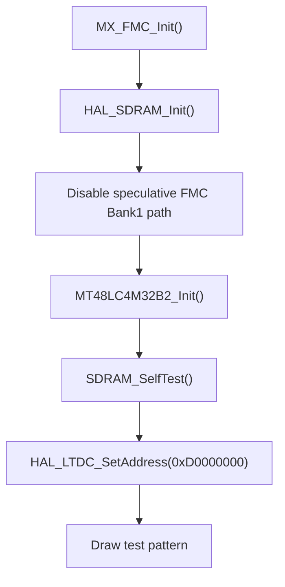

# FMC / SDRAM

## Goal

Explain how external SDRAM is initialized and validated, why the final sequence is more than a plain `HAL_SDRAM_Init()`, and what a developer must preserve when touching the display memory path.

## What This Driver Area Does

External SDRAM is the framebuffer backing store for the display pipeline.

In this project:

- framebuffer base address: `0xD0000000`
- LTDC layer 1 is pointed at SDRAM
- the application writes a test pattern into SDRAM before the UI stack is allowed to proceed

If SDRAM is not valid, the display path is not trustworthy.

Typical failure symptoms include:

- hard faults during early startup
- self-test mismatches
- black display output
- corrupted framebuffer content
- LTDC using an address that looks valid but is not backed by stable SDRAM

## Memory Ownership

### Bootloader side

The bootloader prepares external memory early as part of the board bring-up model.

Primary file:

- [ExtMem_Boot/Src/fmc.c](C:/st_apps/coffee_machine/ExtMem_Boot/Src/fmc.c)

That file performs a complete FMC/SDRAM configuration and startup sequence, including explicit SDRAM commands and refresh-rate programming.

### Application side

The application still performs its own FMC/SDRAM initialization in the current design, because the display stack depends on a valid SDRAM framebuffer inside the app runtime.

Primary files:

- [Core/Src/fmc.c](C:/st_apps/coffee_machine/Core/Src/fmc.c)
- [Core/Src/main.cpp](C:/st_apps/coffee_machine/Core/Src/main.cpp)

## How It Works

## Framebuffer model

The framebuffer used by the test-pattern path is declared in [main.cpp](C:/st_apps/coffee_machine/Core/Src/main.cpp) and placed in the `.framebuffer` section.

Relevant constants:

- `LCD_FRAMEBUFFER_ADDR = 0xD0000000`
- `LCD_WIDTH = 480`
- `LCD_HEIGHT = 272`

The application then:

- validates SDRAM with `SDRAM_SelfTest()`
- points LTDC layer 1 at `LCD_FRAMEBUFFER_ADDR`
- draws color bars
- flushes cache lines
- enables the panel/backlight

## Application-side SDRAM init sequence

The application-side sequence is implemented in [Core/Src/fmc.c](C:/st_apps/coffee_machine/Core/Src/fmc.c).

Current flow:

1. configure `hsdram1` and FMC timing
2. call `HAL_SDRAM_Init(&hsdram1, &SdramTiming)`
3. disable FMC Bank1 speculative access:
   - `FMC_Bank1_R->BTCR[0] &= ~FMC_BCRx_MBKEN;`
4. build an `MT48LC4M32B2_Context_t`
5. call `MT48LC4M32B2_Init(&hsdram1, &reg_mode)`

That last step is critical. It performs the actual SDRAM startup command sequence that a plain timing initialization does not cover by itself.

## SDRAM component startup sequence

The Micron SDRAM component driver is:

- [Drivers/BSP/Components/mt48lc4m32b2/mt48lc4m32b2.c](C:/st_apps/coffee_machine/Drivers/BSP/Components/mt48lc4m32b2/mt48lc4m32b2.c)

`MT48LC4M32B2_Init()` performs:

1. clock enable command
2. delay
3. precharge all
4. auto-refresh command
5. mode-register configuration
6. refresh-rate programming

This sequence is the practical difference between:

- "FMC peripheral configured"
- and "external SDRAM is actually ready for runtime use"

## Bootloader-side SDRAM init

The bootloader-side [ExtMem_Boot/Src/fmc.c](C:/st_apps/coffee_machine/ExtMem_Boot/Src/fmc.c) performs a very explicit SDRAM setup:

- `HAL_SDRAM_Init()`
- clock enable command
- precharge all
- auto-refresh
- load mode register
- program refresh rate

That is one of the reasons the bootloader exists in the architecture at all: it prepares external memories before the app relies on them.

## Validation path in the application

The app validates SDRAM explicitly in [main.cpp](C:/st_apps/coffee_machine/Core/Src/main.cpp):

- `SDRAM_SelfTest()` writes several 32-bit patterns to SDRAM
- cache is cleaned/invalidated for the tested area
- the patterns are read back and compared
- the app refuses to continue into the normal display path if the test fails

That validation step turned out to be extremely useful during bring-up and should be preserved while the system is still under active development.

## Bring-up Lessons

### 1. `HAL_SDRAM_Init()` alone was not enough

One major bring-up lesson was that configuring FMC timing alone did not produce a stable framebuffer path.

The working fix was to keep:

- `HAL_SDRAM_Init()`
- plus the full `MT48LC4M32B2_Init()` command sequence

Removing the component-level startup sequence would risk returning to earlier black-screen or hard-fault failures.

### 2. Delay code must tolerate an early or stalled tick source

The SDRAM component originally depended on `HAL_GetTick()` for its delay step.

During bring-up this could stall in early startup, so [mt48lc4m32b2.c](C:/st_apps/coffee_machine/Drivers/BSP/Components/mt48lc4m32b2/mt48lc4m32b2.c) was adjusted to fall back to a bounded busy-wait when the tick does not advance.

That fallback is not cosmetic. It is part of the final stable startup behavior.

### 3. Speculative access settings mattered

The application-side FMC path explicitly disables FMC Bank1 speculative access before continuing.

This reflects a real bring-up lesson: early speculative or premature access behavior can create hard-to-explain startup faults when external memories are not yet in a fully safe runtime state.

Related note in the system startup code:

- [Core/Src/system_stm32h7xx.c](C:/st_apps/coffee_machine/Core/Src/system_stm32h7xx.c)

That file documents why the application no longer re-touches fragile FMC speculative configuration in the XIP startup path.

### 4. Validate before enabling the UI stack

The SDRAM self-test before display bring-up is a deliberate engineering choice.

It gives a developer a fast answer to a common question:

- is the display logic wrong, or is the framebuffer memory not trustworthy yet?

That separation was important during bring-up and remains useful for later regressions.

## What To Preserve

If a developer changes the SDRAM path, the following assumptions must remain true:

- SDRAM is fully initialized before LTDC uses the framebuffer
- the component-level SDRAM startup sequence is not accidentally removed
- the delay path does not depend blindly on SysTick already being alive
- framebuffer address assumptions remain aligned across SDRAM, LTDC, and the application
- the validation/self-test path remains available during bring-up and debugging

## Files To Read First

For a developer who needs to understand this area, read these files first:

- [Core/Src/fmc.c](C:/st_apps/coffee_machine/Core/Src/fmc.c)
- [Core/Src/main.cpp](C:/st_apps/coffee_machine/Core/Src/main.cpp)
- [ExtMem_Boot/Src/fmc.c](C:/st_apps/coffee_machine/ExtMem_Boot/Src/fmc.c)
- [Core/Src/system_stm32h7xx.c](C:/st_apps/coffee_machine/Core/Src/system_stm32h7xx.c)
- [Drivers/BSP/STM32H750B-DK/stm32h750b_discovery_sdram.c](C:/st_apps/coffee_machine/Drivers/BSP/STM32H750B-DK/stm32h750b_discovery_sdram.c)
- [Drivers/BSP/Components/mt48lc4m32b2/mt48lc4m32b2.c](C:/st_apps/coffee_machine/Drivers/BSP/Components/mt48lc4m32b2/mt48lc4m32b2.c)

## ST References

- [UM2488 - Discovery kit with STM32H750XB microcontroller](https://www.st.com/resource/en/user_manual/um2488-discovery-kits-with-stm32h745xi-and-stm32h750xb-microcontrollers-stmicroelectronics.pdf)
- [AN5188 - External memory code execution on STM32F7x0 value line, STM32H750 value line, STM32H7B0 value line and STM32H730 value line MCUs](https://www.st.com/resource/en/application_note/an5188-external-memory-code-execution-on-stm32f7x0-value-line-stm32h750-value-line-stm32h7b0-value-line-and-stm32h730-value-line-mcus-stmicroelectronics.pdf)
