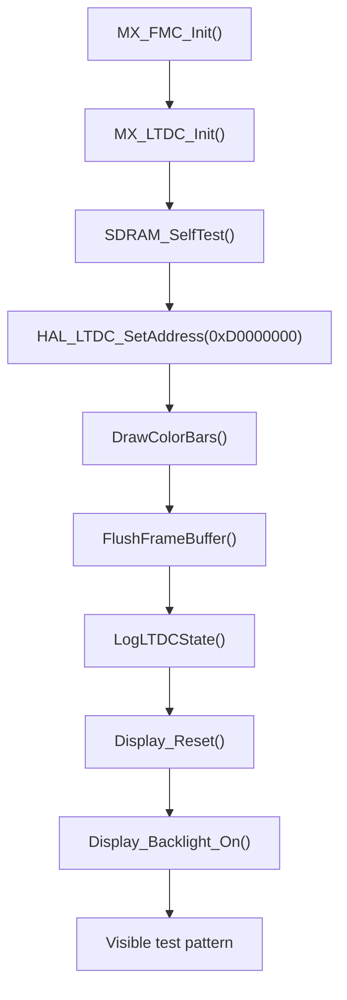

# LTDC / Display

## Goal

Explain how the display pipeline is brought up, how LTDC is connected to the SDRAM framebuffer, and what a developer must verify when the panel stays black or shows corrupted output.

## What This Driver Area Does

The LTDC block is the display controller that reads pixel data from memory and drives the LCD interface pins.

In this project, LTDC is responsible for:

- driving the 480x272 panel timing
- reading the framebuffer from SDRAM
- presenting the early test pattern before TouchGFX is enabled

This makes LTDC the visible end of a larger chain:

- SDRAM must be valid
- framebuffer contents must be written correctly
- cache must be flushed
- LTDC must point at the correct framebuffer address
- the panel reset and backlight sequence must be correct

## Runtime Ownership

The application owns the display bring-up after the bootloader has handed off a valid execution environment.

Primary files:

- [Core/Src/ltdc.c](C:/st_apps/coffee_machine/Core/Src/ltdc.c)
- [Core/Src/main.cpp](C:/st_apps/coffee_machine/Core/Src/main.cpp)
- [Core/Src/gpio.c](C:/st_apps/coffee_machine/Core/Src/gpio.c)
- [Core/Inc/main.h](C:/st_apps/coffee_machine/Core/Inc/main.h)

The bootloader does not own the panel bring-up sequence. The app does.

## How It Works

## LTDC peripheral configuration

The LTDC initialization is implemented in [ltdc.c](C:/st_apps/coffee_machine/Core/Src/ltdc.c).

Important settings in `MX_LTDC_Init()`:

- panel size: `480 x 272`
- pixel format: `LTDC_PIXEL_FORMAT_RGB565`
- layer 0 window: full screen
- initial layer framebuffer address: `3489660928`

That decimal address equals:

- `0xD0000000`

which matches the SDRAM framebuffer base used by the application.

The peripheral also configures:

- HSYNC / VSYNC / DE / pixel clock polarity
- timing registers for front porch, back porch, active area, and total area
- LTDC clock through PLL3

## GPIO and panel signals

The LTDC MSP init in [ltdc.c](C:/st_apps/coffee_machine/Core/Src/ltdc.c) configures the full LCD signal group across GPIOI/J/K/H.

Additional panel control pins are owned by GPIO code:

- backlight pin:
  - [Core/Inc/main.h](C:/st_apps/coffee_machine/Core/Inc/main.h)
  - `LCD_BL_Pin`
- reset pin:
  - [Core/Inc/main.h](C:/st_apps/coffee_machine/Core/Inc/main.h)
  - `LCD_RST_Pin`

Those pins are initialized in:

- [Core/Src/gpio.c](C:/st_apps/coffee_machine/Core/Src/gpio.c)

The app then uses:

- `Display_Reset()`
- `Display_Backlight_On()`

from [main.cpp](C:/st_apps/coffee_machine/Core/Src/main.cpp).

## Display bring-up sequence in the app

The visible display path is assembled in [main.cpp](C:/st_apps/coffee_machine/Core/Src/main.cpp).

Current flow:

1. `MX_FMC_Init()`
2. `MX_LTDC_Init()`
3. validate SDRAM with `SDRAM_SelfTest()`
4. call `HAL_LTDC_SetAddress(&hltdc, LCD_FRAMEBUFFER_ADDR, 0)`
5. draw color bars into the framebuffer
6. flush cache with `FlushFrameBuffer()`
7. log LTDC register state with `LogLTDCState()`
8. toggle panel reset with `Display_Reset()`
9. enable backlight with `Display_Backlight_On()`

That sequence is deliberate. It separates:

- memory validity
- controller validity
- visible panel activation

## Framebuffer update model

The framebuffer is declared in [main.cpp](C:/st_apps/coffee_machine/Core/Src/main.cpp) and tied to:

- `LCD_FRAMEBUFFER_ADDR = 0xD0000000`

The test pattern is created by `DrawColorBars()` and then committed for LTDC consumption by:

- `FlushFrameBuffer()`

`FlushFrameBuffer()` currently uses:

- `SCB_CleanDCache()`
- `__DSB()`
- `__ISB()`

That cache maintenance is important because LTDC is a bus master reading memory directly, not reading the CPU's dirty cache lines.

## LTDC diagnostics

The project includes an explicit LTDC logging helper:

- `LogLTDCState()`

It prints:

- `LTDC->SSCR`
- `LTDC->BPCR`
- `LTDC->AWCR`
- `LTDC->TWCR`
- `LTDC->GCR`
- `LTDC_Layer1->CFBAR`
- `LTDC_Layer1->CFBLR`
- `LTDC_Layer1->CFBLNR`
- `LTDC_Layer1->CR`

This is extremely useful during bring-up because it answers a practical question quickly:

- is the display pipeline wrong because LTDC is misconfigured, or because the framebuffer content/memory is wrong?

## Bring-up Lessons

### 1. A black screen is not automatically an LTDC problem

One of the big practical lessons was that a black screen can come from several layers:

- SDRAM not valid
- framebuffer not written correctly
- cache not flushed
- LTDC not pointed at the intended framebuffer
- panel reset/backlight sequence not completed

That is why the app now performs a visible staged bring-up instead of enabling the full UI stack immediately.

### 2. The test pattern is a real engineering tool

The color-bar pattern is not cosmetic. It is a focused validation step for:

- SDRAM writes
- framebuffer addressing
- LTDC readout
- panel enable path

If the test pattern is visible, the display base path is already largely proven.

### 3. Panel reset and backlight matter

Even with valid LTDC timing and valid framebuffer memory, the display can still appear dead if:

- the panel reset line is not toggled correctly
- the backlight remains off

That is why the app explicitly performs:

- `Display_Reset()`
- `Display_Backlight_On()`

after the framebuffer and LTDC setup have already been validated.

### 4. Cache maintenance is part of the display path

Because the CPU writes into the framebuffer and LTDC reads from memory, cache state is part of correctness.

If a developer changes:

- framebuffer placement
- pixel format
- draw path
- DMA2D usage

they must revisit the cache-maintenance assumptions too.

## Display Bring-Up Flow

## What To Preserve

If a developer changes the display path, the following assumptions must remain true:

- LTDC layer 0 still points at the intended framebuffer address
- the framebuffer format remains aligned with LTDC layer pixel format
- the display is not enabled before SDRAM has been validated
- cache flushing remains correct for framebuffer updates
- reset and backlight control remain part of the bring-up sequence

## Files To Read First

For a developer who needs to understand this area, start here:

- [Core/Src/ltdc.c](C:/st_apps/coffee_machine/Core/Src/ltdc.c)
- [Core/Src/main.cpp](C:/st_apps/coffee_machine/Core/Src/main.cpp)
- [Core/Src/gpio.c](C:/st_apps/coffee_machine/Core/Src/gpio.c)
- [Core/Inc/main.h](C:/st_apps/coffee_machine/Core/Inc/main.h)
- [docs/04-drivers/fmc-sdram.md](C:/st_apps/coffee_machine/docs/04-drivers/fmc-sdram.md)

## ST References

- [UM2488 - Discovery kit with STM32H750XB microcontroller](https://www.st.com/resource/en/user_manual/um2488-discovery-kits-with-stm32h745xi-and-stm32h750xb-microcontrollers-stmicroelectronics.pdf)

