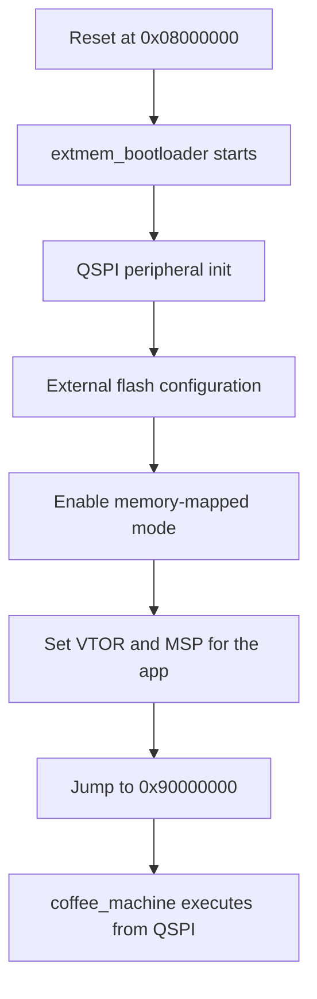

# QSPI / External Flash / XIP

## Goal

Explain how the project executes the main application from external QSPI flash, which part of the system owns the first XIP activation, and what a developer must preserve when changing this area.

## What This Driver Area Does

The external QSPI flash is not used as passive storage only. It is part of the runtime execution path.

In this project, QSPI is used for:

- the main application image at `0x90000000`
- generated assets in external flash space

This means instruction fetches must succeed from external flash after the bootloader has completed memory bring-up.

## Runtime Ownership

### Bootloader ownership

The bootloader owns the first valid QSPI/XIP transition.

Its responsibilities are:

- initialize the QSPI peripheral
- configure the external flash device
- enable memory-mapped mode
- jump to the application only after external execution is valid

Primary files:

- [ExtMem_Boot/Src/main.c](C:/st_apps/coffee_machine/ExtMem_Boot/Src/main.c)
- [ExtMem_Boot/Src/qspi.c](C:/st_apps/coffee_machine/ExtMem_Boot/Src/qspi.c)
- [ExtMem_Boot/Inc/memory.h](C:/st_apps/coffee_machine/ExtMem_Boot/Inc/memory.h)

### Application ownership

The application executes from QSPI after the hand-off. It still contains QSPI-related code, but the stable runtime model is:

- the bootloader performs the first XIP activation
- the application must not break that early state during startup

Primary files:

- [Core/Src/main.cpp](C:/st_apps/coffee_machine/Core/Src/main.cpp)
- [Core/Src/quadspi.c](C:/st_apps/coffee_machine/Core/Src/quadspi.c)
- [Core/Src/system_stm32h7xx.c](C:/st_apps/coffee_machine/Core/Src/system_stm32h7xx.c)

## How It Works

## Memory View

- Internal bootloader start: `0x08000000`
- External application start: `0x90000000`
- Assets flash region: `0x90200000`

The bootloader selects `APPLICATION_ADDRESS` through [memory.h](C:/st_apps/coffee_machine/ExtMem_Boot/Inc/memory.h). For the QSPI configuration, this resolves to `QSPI_BASE`, i.e. `0x90000000`.

## Bootloader QSPI path

The bootloader-side [qspi.c](C:/st_apps/coffee_machine/ExtMem_Boot/Src/qspi.c) contains the low-level startup sequence that makes external execution possible.

Important practical behavior:

- `QSPI_Startup()` configures the peripheral and the flash device
- `QSPI_EnableMemoryMappedMode()` calls `HAL_QSPI_MemoryMapped()`
- the application image is expected to become executable at `0x90000000`

The jump itself is performed in [main.c](C:/st_apps/coffee_machine/ExtMem_Boot/Src/main.c):

- `JumpToApplication = (pFunction)(*(__IO uint32_t*)(APPLICATION_ADDRESS + 4));`
- `SCB->VTOR = APPLICATION_ADDRESS;`
- `__set_MSP(*(__IO uint32_t*) APPLICATION_ADDRESS);`
- `JumpToApplication();`

The bootloader also performs cleanup before the jump:

- `NVIC_Cleanup();`
- `SysTick->CTRL = 0;`

That cleanup matters because stale interrupts and the old vector table can break the application immediately after hand-off.

## Application-side QSPI code

The application-side [quadspi.c](C:/st_apps/coffee_machine/Core/Src/quadspi.c) still contains a valid CubeMX/BSP-based QSPI path:

- `MX_QUADSPI_Init()`
- `BSP_QSPI_Init(0, &init);`
- `BSP_QSPI_EnableMemoryMappedMode(0);`

This code is useful as reference and as a possible recovery path, but the stable bring-up rule is still:

- do not rely on the application to perform the first XIP activation

The application currently assumes that external execution is already valid when `main()` starts.

That intent is documented directly in [main.cpp](C:/st_apps/coffee_machine/Core/Src/main.cpp):

- `/* QSPI is already configured for XIP by extmem_boot before jumping here. */`

## ST BSP and flash component layers

The project relies on the ST board support and flash component stack:

- [Drivers/BSP/STM32H750B-DK/stm32h750b_discovery_qspi.c](C:/st_apps/coffee_machine/Drivers/BSP/STM32H750B-DK/stm32h750b_discovery_qspi.c)
- [Drivers/BSP/Components/mt25tl01g/mt25tl01g.c](C:/st_apps/coffee_machine/Drivers/BSP/Components/mt25tl01g/mt25tl01g.c)

This matters because the final stable path was not simply "enable QUADSPI". The working path depended on using the correct flash-mode sequence for the board and memory device.

In particular:

- `BSP_QSPI_EnableMemoryMappedMode()` delegates to the component layer
- the component layer uses either `MT25TL01G_EnableMemoryMappedModeSTR()` or `...DTR()`
- both ultimately rely on `HAL_QSPI_MemoryMapped()`

## Bring-up Lessons

### 1. First XIP activation belongs in the bootloader

The robust runtime model was achieved only after treating the internal bootloader as the owner of the first external-execution transition.

The stable sequence is:

### 2. Early application-side reconfiguration can break XIP

During bring-up, the system became unstable when the application tried to take ownership of QSPI too early.

Practical rule:

- bootloader performs first XIP activation
- application should treat XIP as an already valid hand-off state

If that rule changes, the startup sequence must be reviewed end-to-end.

### 3. Direct app boot was not accepted as the normal path

Direct boot attempts into `0x90000000` were explored as a debug convenience, but they were not made the default architecture.

The project deliberately keeps:

- boot from internal flash
- runtime hand-off into external XIP

That choice is documented in the architecture chapter because it affects runtime, debug behavior, and failure modes.

### 4. Debugging XIP is sensitive to breakpoint strategy

One important developer lesson was that software-breakpoint or flash-hotpatch behavior can interfere with early boot-to-app startup.

The validated Boot-to-App debug flow therefore relies on explicit symbol handling and controlled breakpoint behavior. See:

- [docs/03-debugging/README.md](C:/st_apps/coffee_machine/docs/03-debugging/README.md)

## What To Preserve

If a developer changes the QSPI/XIP area, the following assumptions must remain true:

- the board still boots from internal flash
- the bootloader still prepares QSPI before the application runs
- `APPLICATION_ADDRESS` for the app remains aligned with the application linker/startup assumptions
- the application still expects to execute from `0x90000000`
- early startup code does not blindly reconfigure QSPI in a way that breaks external instruction fetches

If one of these changes, runtime and debug documentation must be updated together.

## Files To Read First

For a developer who needs to understand or rebuild this path, these are the first files to inspect:

- [ExtMem_Boot/Src/main.c](C:/st_apps/coffee_machine/ExtMem_Boot/Src/main.c)
- [ExtMem_Boot/Src/qspi.c](C:/st_apps/coffee_machine/ExtMem_Boot/Src/qspi.c)
- [ExtMem_Boot/Inc/memory.h](C:/st_apps/coffee_machine/ExtMem_Boot/Inc/memory.h)
- [Core/Src/main.cpp](C:/st_apps/coffee_machine/Core/Src/main.cpp)
- [Core/Src/quadspi.c](C:/st_apps/coffee_machine/Core/Src/quadspi.c)
- [Drivers/BSP/STM32H750B-DK/stm32h750b_discovery_qspi.c](C:/st_apps/coffee_machine/Drivers/BSP/STM32H750B-DK/stm32h750b_discovery_qspi.c)
- [Drivers/BSP/Components/mt25tl01g/mt25tl01g.c](C:/st_apps/coffee_machine/Drivers/BSP/Components/mt25tl01g/mt25tl01g.c)
- [STM32H750XBHX_FLASH.ld](C:/st_apps/coffee_machine/STM32H750XBHX_FLASH.ld)

## ST References

- [AN5188 - External memory code execution on STM32F7x0 value line, STM32H750 value line, STM32H7B0 value line and STM32H730 value line MCUs](https://www.st.com/resource/en/application_note/an5188-external-memory-code-execution-on-stm32f7x0-value-line-stm32h750-value-line-stm32h7b0-value-line-and-stm32h730-value-line-mcus-stmicroelectronics.pdf)
- [UM2488 - Discovery kit with STM32H750XB microcontroller](https://www.st.com/resource/en/user_manual/um2488-discovery-kits-with-stm32h745xi-and-stm32h750xb-microcontrollers-stmicroelectronics.pdf)

