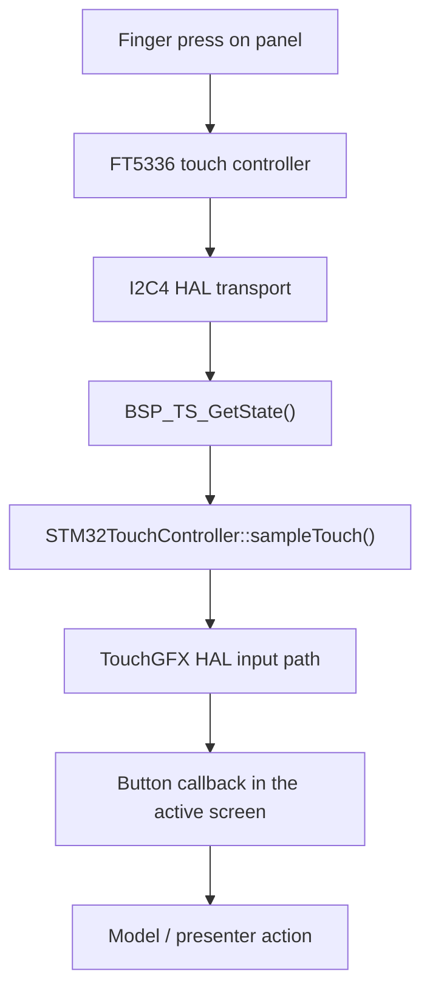

# Touch / Input

## Goal

Explain how touch input reaches TouchGFX on the STM32H750B-DK and what a developer should verify when the UI is visible but touch interaction does not work.

## What This Driver Area Does

The touch path is separate from the display path.

The display side pushes pixels out through LTDC.

The touch side pulls finger coordinates in through the FT5336 touch controller and passes them to TouchGFX.

In this project, the touch subsystem is responsible for:

- configuring the board touch controller through the BSP
- sampling the current touch position
- mapping touch coordinates into the `480 x 272` UI space
- forwarding those coordinates to TouchGFX button handling

## Runtime Ownership

The touch pipeline is shared across three layers:

- CubeMX/HAL owns the low-level `I2C4` peripheral setup
- the ST BSP owns the FT5336 integration
- `STM32TouchController` owns the TouchGFX-facing sampling path

Primary files:

- [TouchGFX/target/STM32TouchController.cpp](C:/st_apps/coffee_machine/TouchGFX/target/STM32TouchController.cpp)
- [Core/Src/i2c.c](C:/st_apps/coffee_machine/Core/Src/i2c.c)
- [Core/Inc/app_config.h](C:/st_apps/coffee_machine/Core/Inc/app_config.h)
- [Core/Inc/stm32h750b_discovery_conf.h](C:/st_apps/coffee_machine/Core/Inc/stm32h750b_discovery_conf.h)
- [Drivers/BSP/STM32H750B-DK/stm32h750b_discovery_ts.c](C:/st_apps/coffee_machine/Drivers/BSP/STM32H750B-DK/stm32h750b_discovery_ts.c)
- [Drivers/BSP/STM32H750B-DK/stm32h750b_discovery_bus.c](C:/st_apps/coffee_machine/Drivers/BSP/STM32H750B-DK/stm32h750b_discovery_bus.c)
- [Drivers/BSP/Components/ft5336/ft5336.c](C:/st_apps/coffee_machine/Drivers/BSP/Components/ft5336/ft5336.c)
- [Drivers/BSP/Components/ft5336/ft5336_reg.c](C:/st_apps/coffee_machine/Drivers/BSP/Components/ft5336/ft5336_reg.c)

## How It Works

## HAL-level transport

The FT5336 controller is connected through `I2C4`.

Current hardware-side setup:

- peripheral: `I2C4`
- pins:
  - `PD12 -> I2C4_SCL`
  - `PD13 -> I2C4_SDA`
- clock source: `RCC_I2C4CLKSOURCE_D3PCLK1`

This configuration is generated in:

- [Core/Src/i2c.c](C:/st_apps/coffee_machine/Core/Src/i2c.c)

That means CubeMX owns the low-level bus wiring, while the BSP owns the FT5336 device protocol on top of it.

## BSP touch driver layer

The board support package exposes the touch controller through:

- `BSP_TS_Init()`
- `BSP_TS_GetState()`

The board-specific implementation lives in:

- [Drivers/BSP/STM32H750B-DK/stm32h750b_discovery_ts.c](C:/st_apps/coffee_machine/Drivers/BSP/STM32H750B-DK/stm32h750b_discovery_ts.c)

Important facts in the current project:

- the FT5336 component is probed during `BSP_TS_Init()`
- the BSP stores width, height, orientation, and accuracy in `Ts_Ctx`
- `BSP_TS_GetState()` applies orientation and coordinate scaling before returning the touch sample

The project configuration in:

- [Core/Inc/stm32h750b_discovery_conf.h](C:/st_apps/coffee_machine/Core/Inc/stm32h750b_discovery_conf.h)

currently keeps the touch path simple:

- `USE_TS_GESTURE = 0`
- `USE_TS_MULTI_TOUCH = 0`
- `TS_TOUCH_NBR = 5`

In other words:

- no gesture decoding
- no application use of multi-touch
- a single-touch UI path is the intended operating mode

## TouchGFX adapter layer

TouchGFX itself does not talk directly to the FT5336 component.

Instead, it talks to:

- `STM32TouchController::init()`
- `STM32TouchController::sampleTouch()`

implemented in:

- [TouchGFX/target/STM32TouchController.cpp](C:/st_apps/coffee_machine/TouchGFX/target/STM32TouchController.cpp)

Current runtime behavior:

- `init()` builds a `TS_Init_t` structure
- width and height come from:
  - `APP_LCD_WIDTH`
  - `APP_LCD_HEIGHT`
- touch accuracy comes from:
  - `APP_TOUCH_ACCURACY`
- orientation is currently:
  - `TS_SWAP_XY`
- `BSP_TS_Init(0, &touchScreenConfig)` initializes the BSP path
- `sampleTouch()` calls `BSP_TS_GetState(0, &state)` on each UI sampling pass

This layer also emits practical debug logs:

- `touch init: ok` or `touch init: failed`
- throttled touch coordinate samples

Those logs were useful during bring-up and are still useful when a developer needs to decide whether the problem is:

- no controller init
- no coordinate updates
- or a higher-level TouchGFX event issue

## End-to-end flow

## Relationship To LTDC / Display

Touch and display are separate driver paths, but they must agree on the same screen geometry.

The practical coupling points are:

- panel size is `480 x 272`
- touch coordinates are scaled into the same size
- screen orientation must match what the user sees on the display
- TouchGFX sits at the point where both paths meet

That is why a system can be in one of these states:

- display works, touch does not
- touch samples exist, but buttons do not react
- both work electrically, but coordinates are mirrored or swapped

For the display side, see:

- [LTDC / Display](./ltdc-display.md)

## What CubeMX Owns And What It Does Not

CubeMX can configure:

- `I2C4`
- GPIO pin muxing
- peripheral clocks
- optional interrupt wiring

CubeMX does not own the FT5336 BSP/component integration logic itself.

That part is project-side code and must remain present in the build:

- board BSP touch files
- FT5336 component driver files
- TouchGFX target adapter glue

So the practical rule is:

- use CubeMX for the bus and pin configuration
- keep the BSP/component files and TouchGFX glue under project control

## Bring-up Lessons

### 1. Touch was not just a TouchGFX problem

The project only became stable after the touch path was treated as a real driver stack:

- HAL bus
- BSP device integration
- TouchGFX adapter

That separation matters because each layer fails differently.

### 2. Orientation is part of correctness

The current setup uses:

- `TS_SWAP_XY`

That setting is not cosmetic. It decides whether touch coordinates match what the display shows.

### 3. The BSP state path can fail before the UI knows anything

If:

- `BSP_TS_Init()` fails
- `BSP_TS_GetState()` fails
- or the FT5336 probe fails

then TouchGFX will never receive meaningful touch data.

### 4. Display-visible does not imply touch-ready

A valid LTDC path only proves:

- framebuffer
- panel timing
- panel control

It says nothing about:

- I2C4 wiring
- FT5336 communication
- or TouchGFX touch sampling

## What To Preserve

If a developer changes the touch path, the following assumptions must remain true:

- `I2C4` remains configured for the FT5336 bus
- `APP_LCD_WIDTH` and `APP_LCD_HEIGHT` stay aligned with the real display geometry
- the BSP touch component files remain part of the build
- `STM32TouchController` continues to initialize and sample the BSP state
- orientation remains consistent with the displayed image

## Symptom Guide

- **Display works but no touch samples appear**
  - start with [STM32TouchController.cpp](C:/st_apps/coffee_machine/TouchGFX/target/STM32TouchController.cpp)
  - then [i2c.c](C:/st_apps/coffee_machine/Core/Src/i2c.c)
  - then [stm32h750b_discovery_ts.c](C:/st_apps/coffee_machine/Drivers/BSP/STM32H750B-DK/stm32h750b_discovery_ts.c)

- **Touch samples appear, but buttons do not react**
  - check screen callbacks and TouchGFX event wiring
  - then verify coordinate mapping and orientation

- **Touch reacts in the wrong place**
  - start with the orientation configuration in [STM32TouchController.cpp](C:/st_apps/coffee_machine/TouchGFX/target/STM32TouchController.cpp)
  - then inspect scaling in [stm32h750b_discovery_ts.c](C:/st_apps/coffee_machine/Drivers/BSP/STM32H750B-DK/stm32h750b_discovery_ts.c)

## Files To Read First

- [TouchGFX/target/STM32TouchController.cpp](C:/st_apps/coffee_machine/TouchGFX/target/STM32TouchController.cpp)
- [Core/Src/i2c.c](C:/st_apps/coffee_machine/Core/Src/i2c.c)
- [Core/Inc/app_config.h](C:/st_apps/coffee_machine/Core/Inc/app_config.h)
- [Drivers/BSP/STM32H750B-DK/stm32h750b_discovery_ts.c](C:/st_apps/coffee_machine/Drivers/BSP/STM32H750B-DK/stm32h750b_discovery_ts.c)
- [Drivers/BSP/Components/ft5336/ft5336.c](C:/st_apps/coffee_machine/Drivers/BSP/Components/ft5336/ft5336.c)

## ST References

- [UM2488 - Discovery kit with STM32H750XB microcontroller](https://www.st.com/resource/en/user_manual/um2488-discovery-kits-with-stm32h745xi-and-stm32h750xb-microcontrollers-stmicroelectronics.pdf)
