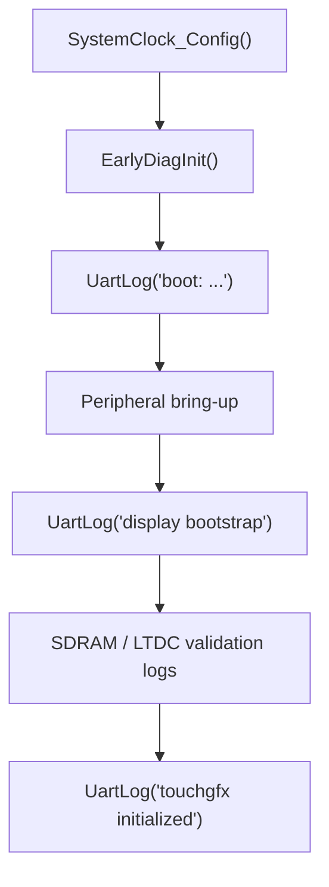

# UART / Debug Output

## Goal

Explain how early UART diagnostics work, why they were important during bring-up, and how a developer should use them together with the debugger.

## What This Driver Area Does

The UART path provides textual diagnostics during early startup and display bring-up.

In this project it is used to answer practical bring-up questions such as:

- did the application reach `main()`?
- did the system clock finish?
- did SDRAM validation pass?
- did the display become enabled?
- did the code reach the TouchGFX boundary?

Without this channel, many early failures would only appear as:

- a black display
- a debugger stop in a hard fault
- or an apparently silent reset/restart

## Runtime Ownership

UART debug output is owned by the application.

Primary files:

- [Core/Src/usart.c](C:/st_apps/coffee_machine/Core/Src/usart.c)
- [Core/Src/main.cpp](C:/st_apps/coffee_machine/Core/Src/main.cpp)

## How It Works

## Peripheral configuration

The UART instance used for debug logs is:

- `USART3`

configured in [usart.c](C:/st_apps/coffee_machine/Core/Src/usart.c) with:

- baud rate: `115200`
- word length: `8`
- parity: none
- stop bits: `1`
- mode: TX/RX

GPIO mapping:

- `PB10` -> `USART3_TX`
- `PB11` -> `USART3_RX`

These are the VCP pins used through the on-board ST-LINK virtual COM port path.

## Early initialization strategy

The application deliberately initializes UART early through:

- `EarlyDiagInit()`

in [main.cpp](C:/st_apps/coffee_machine/Core/Src/main.cpp).

That helper currently does:

- `MX_USART3_UART_Init();`

before the rest of the peripheral bring-up is complete.

This is important because it allows logs such as:

- `boot: clock configured, entering peripheral init`

to appear before the full display pipeline is online.

Later in startup, the app also calls:

- `MX_USART3_UART_Init();`

again as part of the normal generated peripheral initialization sequence.

That duplicate initialization is acceptable in the current design because the primary goal is reliable early diagnostics during bring-up.

## Logging helper

The main logging helper is:

- `UartLog(const char *format, ...)`

implemented in [main.cpp](C:/st_apps/coffee_machine/Core/Src/main.cpp).

Current behavior:

1. format the message via `vsnprintf()`
2. clamp to the local buffer size
3. transmit using:
   - `HAL_UART_Transmit(&huart3, ..., 1000U)`

This makes the UART path simple and blocking, which is appropriate for bring-up and diagnostics.

## Example messages

The current startup path logs messages such as:

- `boot: clock configured, entering peripheral init`
- `coffee_machine display bootstrap`
- `SDRAM self-test passed`
- `display enabled`
- `holding test pattern for 20000 ms`
- `touchgfx initialized`

These messages provide a coarse but very effective execution trace.

## How Developers Should Use It

UART logs and debugger stops complement each other.

Recommended interpretation:

- UART tells you how far the software got without stopping execution
- the debugger tells you exactly where to inspect state next

Typical examples:

- no UART output at all:
  - suspect very early startup, boot hand-off, or debugger startup behavior
- `boot: ...` appears but no later display logs:
  - suspect app peripheral bring-up
- `SDRAM self-test failed`:
  - inspect SDRAM/FMC path first, not LTDC
- `display enabled` but still black screen:
  - inspect LTDC/panel/reset/backlight path

## Bring-up Lessons

### 1. Early logs were critical

During bring-up, the UART messages were one of the fastest ways to distinguish:

- app did not start
- app started but memory init failed
- app reached display bring-up
- app reached the TouchGFX boundary

This dramatically reduced the time needed to interpret black-screen failures.

### 2. UART itself was usually not the root problem

At several points during debugging, missing UART output looked like a UART bug but turned out to be:

- a terminal/host-side issue
- an early startup issue before logs were emitted
- or simply a missed capture after reset

That lesson matters because a silent terminal should not immediately be interpreted as a USART3 configuration defect.

### 3. Keep the UART path simple during bring-up

The project uses blocking transmit for startup diagnostics on purpose.

That keeps the failure surface small:

- no DMA dependency
- no interrupt-driven logging dependency
- no logger task dependency

It is easier to trust during hardware bring-up.

## Diagnostic Flow

## What To Preserve

If a developer changes the debug UART path, these assumptions should remain true:

- early startup can emit logs before the full application stack is active
- the logging helper remains simple and reliable
- USART3 pin mapping stays aligned with the board VCP path
- critical startup checkpoints continue to emit clear messages

## Files To Read First

For a developer who needs to understand this area, start here:

- [Core/Src/usart.c](C:/st_apps/coffee_machine/Core/Src/usart.c)
- [Core/Src/main.cpp](C:/st_apps/coffee_machine/Core/Src/main.cpp)
- [docs/03-debugging/README.md](C:/st_apps/coffee_machine/docs/03-debugging/README.md)

## ST References

- [UM2488 - Discovery kit with STM32H750XB microcontroller](https://www.st.com/resource/en/user_manual/um2488-discovery-kits-with-stm32h745xi-and-stm32h750xb-microcontrollers-stmicroelectronics.pdf)
