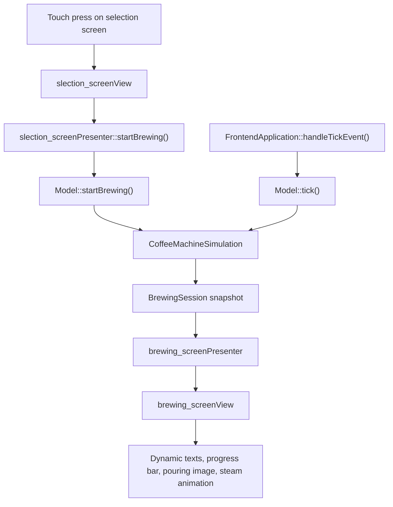

# TouchGFX

## Goal

Describe the current TouchGFX demonstrator state, show where the handwritten UI logic lives, and give a developer a safe re-entry path for further work.

## Current Status

The TouchGFX application is no longer just a placeholder. The current demonstrator flow is implemented and running on the board.

Current user-visible flow:

1. splash screen
2. automatic transition after `5 s`
3. selection screen
4. touch selection of one drink
5. brewing screen with:
   - dynamic coffee name
   - dynamic subtitle
   - countdown
   - progress bar
   - pouring frame sequence
   - steam animation
6. automatic return to the selection screen after brewing completes

Current supported drinks:

- Espresso
- Cappuccino
- Latte
- Americano

## Architecture

TouchGFX is not the owner of the brewing rules.

TouchGFX owns:

- screen layout
- presenter/view wiring
- screen transitions
- visual updates

The brewing-domain rules live outside the generated GUI code in:

- [coffee_machine/coffee_machine_simulation.hpp](C:/st_apps/coffee_machine/coffee_machine/coffee_machine_simulation.hpp)
- [coffee_machine/coffee_machine_simulation.cpp](C:/st_apps/coffee_machine/coffee_machine/coffee_machine_simulation.cpp)

The countdown formatting helper also lives outside TouchGFX:

- [coffee_machine/countdown_formatter.hpp](C:/st_apps/coffee_machine/coffee_machine/countdown_formatter.hpp)
- [coffee_machine/countdown_formatter.cpp](C:/st_apps/coffee_machine/coffee_machine/countdown_formatter.cpp)

That split is intentional. It keeps business logic out of generated files and makes regeneration much safer.

## Runtime Ownership

The current TouchGFX runtime is split across these layers:

### 1. TouchGFX runtime entry

Board-side startup calls:

- `MX_TouchGFX_Init()`
- `MX_TouchGFX_Process()`

through:

- [coffee_machine/coffee_machine_app.cpp](C:/st_apps/coffee_machine/coffee_machine/coffee_machine_app.cpp)

This is the intended boundary between the application bootstrap and the GUI runtime.

### 2. TouchGFX application shell

The application shell lives in:

- [TouchGFX/gui/include/gui/common/FrontendApplication.hpp](C:/st_apps/coffee_machine/TouchGFX/gui/include/gui/common/FrontendApplication.hpp)
- [TouchGFX/gui/src/common/FrontendApplication.cpp](C:/st_apps/coffee_machine/TouchGFX/gui/src/common/FrontendApplication.cpp)

Important current behavior:

- `FrontendApplication::handleTickEvent()` advances the model every UI tick
- `gotoslection_screenScreenNoTransition()` returns to the selection screen
- `gotobrewing_screenScreenNoTransition()` enters the brewing screen

### 3. Model layer

The TouchGFX model lives in:

- [TouchGFX/gui/include/gui/model/Model.hpp](C:/st_apps/coffee_machine/TouchGFX/gui/include/gui/model/Model.hpp)
- [TouchGFX/gui/src/model/Model.cpp](C:/st_apps/coffee_machine/TouchGFX/gui/src/model/Model.cpp)

Important current behavior:

- starts brewing sessions
- updates the simulation using elapsed tick time
- notifies presenters when session data changes
- delays the return to the selection screen by `APP_BREWING_DONE_HOLD_MS`

### 4. Domain simulation

The demonstrator state machine lives outside TouchGFX in:

- [coffee_machine/coffee_machine_simulation.hpp](C:/st_apps/coffee_machine/coffee_machine/coffee_machine_simulation.hpp)
- [coffee_machine/coffee_machine_simulation.cpp](C:/st_apps/coffee_machine/coffee_machine/coffee_machine_simulation.cpp)

Current modeled state:

- selected coffee type
- total brewing time
- elapsed time
- remaining time
- progress percentage
- high-level brewing phase
- steam intensity

### 5. Touch controller adapter

Touch input enters TouchGFX through:

- [TouchGFX/target/STM32TouchController.cpp](C:/st_apps/coffee_machine/TouchGFX/target/STM32TouchController.cpp)

For the lower-level details, see:

- [docs/04-drivers/touch-input.md](../04-drivers/touch-input.md)

## Current Screens

## Splash screen

Files:

- [TouchGFX/gui/include/gui/splash_screen_screen/splash_screenView.hpp](C:/st_apps/coffee_machine/TouchGFX/gui/include/gui/splash_screen_screen/splash_screenView.hpp)
- [TouchGFX/gui/src/splash_screen_screen/splash_screenView.cpp](C:/st_apps/coffee_machine/TouchGFX/gui/src/splash_screen_screen/splash_screenView.cpp)

Current behavior:

- the splash screen is shown first
- it advances automatically after `SPLASH_TIMEOUT_TICKS`
- with the current code that equals `300` UI ticks, which is used as the `5 s` splash dwell

Primary purpose:

- board/demo branding
- visible proof that the UI stack is alive before user interaction starts

## Selection screen

Files:

- [TouchGFX/gui/include/gui/slection_screen_screen/slection_screenView.hpp](C:/st_apps/coffee_machine/TouchGFX/gui/include/gui/slection_screen_screen/slection_screenView.hpp)
- [TouchGFX/gui/src/slection_screen_screen/slection_screenView.cpp](C:/st_apps/coffee_machine/TouchGFX/gui/src/slection_screen_screen/slection_screenView.cpp)
- [TouchGFX/gui/include/gui/slection_screen_screen/slection_screenPresenter.hpp](C:/st_apps/coffee_machine/TouchGFX/gui/include/gui/slection_screen_screen/slection_screenPresenter.hpp)
- [TouchGFX/gui/src/slection_screen_screen/slection_screenPresenter.cpp](C:/st_apps/coffee_machine/TouchGFX/gui/src/slection_screen_screen/slection_screenPresenter.cpp)

Current behavior:

- each drink button has its own callback
- each callback starts brewing with the corresponding `CoffeeType`
- the screen then transitions into the brewing screen

This screen is the main entry point for interaction testing.

## Brewing screen

Files:

- [TouchGFX/gui/include/gui/brewing_screen_screen/brewing_screenView.hpp](C:/st_apps/coffee_machine/TouchGFX/gui/include/gui/brewing_screen_screen/brewing_screenView.hpp)
- [TouchGFX/gui/src/brewing_screen_screen/brewing_screenView.cpp](C:/st_apps/coffee_machine/TouchGFX/gui/src/brewing_screen_screen/brewing_screenView.cpp)
- [TouchGFX/gui/include/gui/brewing_screen_screen/brewing_screenPresenter.hpp](C:/st_apps/coffee_machine/TouchGFX/gui/include/gui/brewing_screen_screen/brewing_screenPresenter.hpp)
- [TouchGFX/gui/src/brewing_screen_screen/brewing_screenPresenter.cpp](C:/st_apps/coffee_machine/TouchGFX/gui/src/brewing_screen_screen/brewing_screenPresenter.cpp)

Current behavior:

- updates dynamic texts from the current `BrewingSession`
- updates the progress bar from the model percentage
- formats the countdown as a plain positive integer string
- selects the current pouring frame based on elapsed brewing progress
- animates steam manually with a ping-pong frame sequence
- returns to the selection screen after the model reports completion

## Dynamic UI Elements

The brewing screen currently uses dynamic text IDs from the TouchGFX text database for:

- `BRSC_BREWING_DYNAMIC_COFFEE_NAME`
- `BRSC_BREWING_DYNAMIC_COFFEE_CHARACTER`
- `BRSC_BREWING_DYNAMIC_COUNTDOWN`

Important practical note:

- the dynamic text IDs, typography, and alignment must exist in the TouchGFX Designer
- centered alignment for these text IDs is important for correct runtime appearance
- fixed widget sizing in the Designer matters more than `auto-size` for stable layout

Current text source of truth:

- [TouchGFX/assets/texts/texts.xml](C:/st_apps/coffee_machine/TouchGFX/assets/texts/texts.xml)

## Assets

The current demonstrator uses these image groups:

### Splash

- `splash_background_420_320.png`

### Selection screen drink cards

- `drink_espresso_150_100.png`
- `drink_cappuccino_150_100.png`
- `drink_latte_150_100.png`
- `drink_americano_150_100.png`

### Brewing screen hero / pouring sequence

- `pouring_frame_01_180_120.png`
- `pouring_frame_02_180_120.png`
- `pouring_frame_03_180_120.png`
- `pouring_frame_04_180_120.png`
- `pouring_frame_05_180_120.png`
- `pouring_frame_06_180_120.png`
- `pouring_frame_07_180_120.png`
- `pouring_frame_08_180_120.png`
- `pouring_frame_09_180_120.png`
- `pouring_frame_10_180_120.png`

### Steam overlay

- `steam_overlay_01_180_120.png`
- `steam_overlay_02_180_120.png`
- `steam_overlay_03_180_120.png`
- `steam_overlay_04_180_120.png`

Asset folder:

- [TouchGFX/assets/images](C:/st_apps/coffee_machine/TouchGFX/assets/images)

## Animation Rules

## Pouring animation

The pouring animation is currently driven manually by brewing progress.

Implementation:

- [TouchGFX/gui/src/brewing_screen_screen/brewing_screenView.cpp](C:/st_apps/coffee_machine/TouchGFX/gui/src/brewing_screen_screen/brewing_screenView.cpp)

Current rule:

- one of ten pouring frames is selected from the elapsed brewing percentage
- the final hero image uses `BITMAP_POURING_FRAME_10_180_120_ID`
- when brewing finishes, the pouring overlay is hidden

## Steam animation

The steam animation is also driven manually.

Current rule:

- four steam overlay frames
- ping-pong animation, not hard wraparound
- tick interval depends on `SteamLevel`
- tick intervals are defined in:
  - [Core/Inc/app_config.h](C:/st_apps/coffee_machine/Core/Inc/app_config.h)

Current tuning constants:

- `APP_STEAM_TICK_INTERVAL_LOW`
- `APP_STEAM_TICK_INTERVAL_NORMAL`
- `APP_STEAM_TICK_INTERVAL_STRONG`

That means a developer can tune steam speed without touching the screen code.

## Simulator Support

The simulator path is intentionally supported.

Current simulator-specific behavior:

- `Model.cpp` uses a `std::chrono::steady_clock` tick source when `SIMULATOR` is defined
- simulator logging uses `std::printf()`
- board builds use `HAL_GetTick()` and `AppDebugLog()`

This gives the same high-level UI behavior in:

- simulator
- board runtime

without pulling HAL dependencies into the simulator build.

## Generated Code And Safe Edit Boundaries

This is the most important practical rule for future work.

### Safe places for handwritten logic

- `TouchGFX/gui/include/gui/...`
- `TouchGFX/gui/src/...`
- `TouchGFX/target/STM32TouchController.cpp`
- `coffee_machine/coffee_machine_simulation.*`
- `coffee_machine/countdown_formatter.*`
- `coffee_machine/coffee_machine_app.*`

### Regenerated areas to treat carefully

- `TouchGFX/generated/...`
- auto-generated screen base classes
- TouchGFX asset output under generated folders
- CubeMX-generated TouchGFX init glue

So the preferred pattern is:

- layout and IDs in TouchGFX Designer
- business logic in handwritten view/presenter/model files
- reusable non-UI logic in `coffee_machine/`

## What To Preserve During Regeneration

If a developer regenerates code from TouchGFX Designer or CubeMX, the following assumptions should be checked afterwards:

- dynamic text IDs still exist
- typography and alignment for dynamic brewing texts are still correct
- custom view and presenter files were not overwritten
- `STM32TouchController.cpp` is still using the BSP touch path
- simulator include paths still resolve `coffee_machine_simulation.hpp` and `countdown_formatter.hpp`
- the current screen flow is still:
  - splash
  - selection
  - brewing
  - selection

## Re-entry Plan

For a developer returning to the TouchGFX work later, the recommended order is:

1. Read this chapter.
2. Open [TouchGFX/coffee_machine.touchgfx](C:/st_apps/coffee_machine/TouchGFX/coffee_machine.touchgfx) in TouchGFX Designer.
3. Verify the text IDs and typography in [TouchGFX/assets/texts/texts.xml](C:/st_apps/coffee_machine/TouchGFX/assets/texts/texts.xml).
4. Read the model/simulation pair:
   - [TouchGFX/gui/src/model/Model.cpp](C:/st_apps/coffee_machine/TouchGFX/gui/src/model/Model.cpp)
   - [coffee_machine/coffee_machine_simulation.cpp](C:/st_apps/coffee_machine/coffee_machine/coffee_machine_simulation.cpp)
5. Read the brewing screen view, because that is where most current UI behavior lives:
   - [TouchGFX/gui/src/brewing_screen_screen/brewing_screenView.cpp](C:/st_apps/coffee_machine/TouchGFX/gui/src/brewing_screen_screen/brewing_screenView.cpp)
6. If touch interaction is in question, continue with:
   - [Touch / Input](../04-drivers/touch-input.md)

## Typical Pitfalls

- TouchGFX Designer alignment and runtime wildcard positioning can diverge if dynamic text IDs are missing or misconfigured.
- Auto-size and center alignment in the Designer can interact badly with runtime wildcard texts if the text database setup is inconsistent.
- Simulator build issues usually mean include-path or duplicate-source issues, not necessarily GUI logic problems.
- Generated screen base classes are not the right place for long-lived handwritten logic.
- If the board shows the brewing screen but touch does not react, the problem is likely below TouchGFX in the touch driver path.

## Next Sensible Steps

From the current state, the strongest next TouchGFX tasks are:

- refine the visual polish of the brewing screen
- add more realistic brewing-state transitions if needed
- decide whether the demonstrator stays purely simulated or begins to map onto real machine control states
- tighten naming inconsistencies such as `slection_screen` only if the rename cost is worth the churn
- document any future Designer conventions before the UI grows further

## Satisfaction Check

This chapter is in a good place if a developer can answer these questions from it:

- where does TouchGFX start in the runtime?
- which files are generated and which are owned by us?
- where do touch events enter?
- where is brewing behavior modeled?
- where do I change animation timing?
- how do I safely regenerate without losing custom logic?

That bar is now met.
